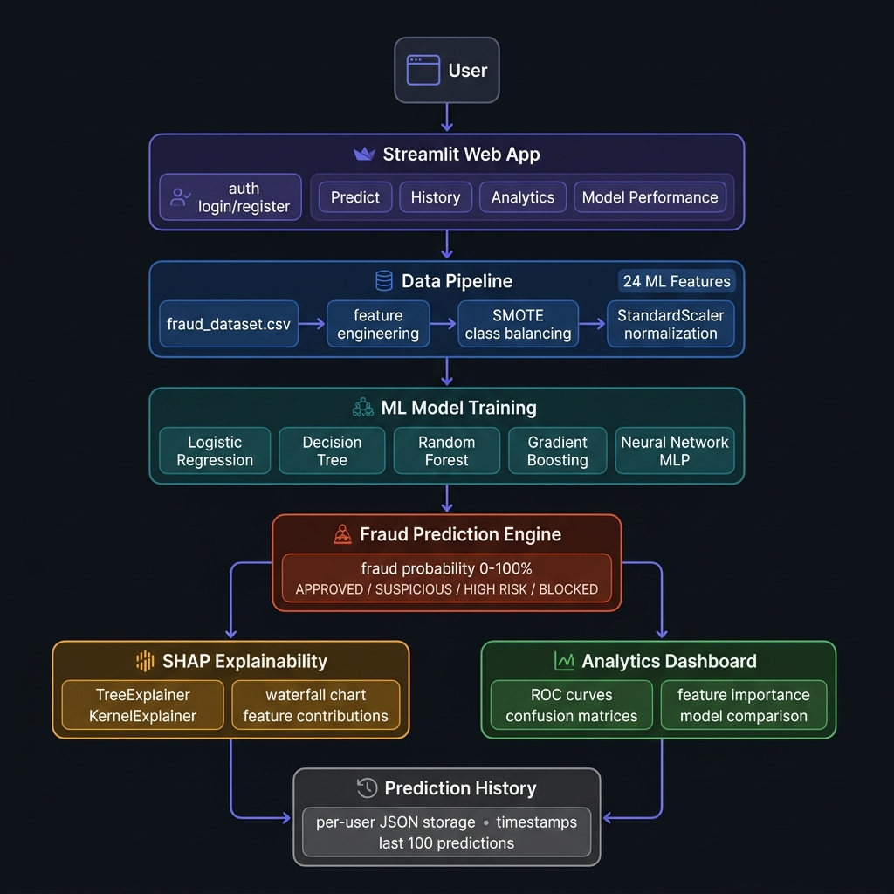
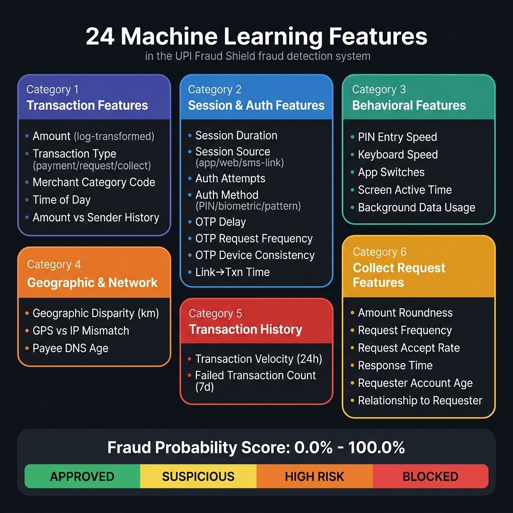

<div align="center">

# 🛡️ UPI Fraud Shield ML

### Intelligent Real-Time UPI Fraud Detection Using Machine Learning & Explainable AI

[](https://python.org)
[](https://streamlit.io)
[](https://scikit-learn.org)
[](https://shap.readthedocs.io)
[](LICENSE)

**An end-to-end ML-powered web application that detects UPI transaction fraud in real time, explains *why* a transaction is flagged using SHAP, and compares 5 machine learning models side-by-side.**

[**🚀 Try the Live Demo**](#-live-demo) · [**📖 Read the Report**](upi-fraud-ml/artifacts/ml-fraud-detection/docs/upi_fraud_detection_report.pdf) · [**⚡ Quick Start**](#-installation--quick-start)

</div>

---

## 📌 Table of Contents

- [Project Overview](#-project-overview)
- [How It Works](#-how-it-works)
- [System Architecture](#-system-architecture)
- [ML Features Used](#-ml-features-used-24-total)
- [Machine Learning Models](#-machine-learning-models)
- [Explainable AI (SHAP)](#-explainable-ai--shap)
- [Application Modules](#-application-modules)
- [Project Structure](#-project-structure)
- [Installation & Quick Start](#-installation--quick-start)
- [Tech Stack](#-tech-stack)
- [Results & Evaluation](#-results--evaluation)
- [Future Enhancements](#-future-enhancements)
- [Author](#-author)

---

## 🎯 Project Overview

India's UPI ecosystem processes over **12 billion transactions per month**. As usage scales, so do fraud attempts — phishing links, SIM swaps, vishing calls, fake collect requests, and account takeovers.

Traditional rule-based fraud systems struggle because:
- Fraud patterns evolve continuously
- They cannot capture subtle behavioral signals
- They produce high false positive rates

**UPI Fraud Shield ML** addresses these challenges by:
- 🤖 Training **5 ML classifiers** on a real-world UPI fraud dataset
- ⚖️ Using **SMOTE** to handle severe class imbalance (~5% fraud rate)
- 🔬 Applying **SHAP** to explain every prediction transparently
- 📊 Evaluating all models with **5 metrics** (Accuracy, Precision, Recall, F1, AUC-ROC)
- 🌐 Delivering results through a **premium Streamlit web app** with user accounts and prediction history

---

## ⚙️ How It Works

The system follows a **5-stage pipeline** from raw data to real-time prediction:

```
Stage 1: Data Ingestion & Cleaning
  fraud_dataset.csv (12 MB, real-world UPI transactions)
  → Drop ID columns, leakage columns, high-correlation columns
  → Log-transform transaction amount (reduce right-skew)
  → Label-encode 4 categorical columns

Stage 2: Class Balancing & Feature Scaling
  → SMOTE (Synthetic Minority Oversampling) to balance fraud/legit ratio
  → StandardScaler fitted on SMOTE-resampled training data only
  → 80/20 stratified train-test split

Stage 3: Model Training (parallel)
  → Train 5 models: Logistic Regression, Decision Tree, Random Forest,
    Gradient Boosting, Neural Network (MLP)
  → Each model uses balanced class weights + regularization

Stage 4: Real-Time Prediction
  User inputs 24 transaction features via the web form
  → Encode categoricals with fitted LabelEncoders
  → Scale inputs with fitted StandardScaler
  → Selected model outputs: fraud probability (0–100%)
  → Risk band classification: APPROVED / SUSPICIOUS / HIGH RISK / BLOCKED

Stage 5: SHAP Explanation
  → TreeExplainer (RF, GB, DT) or KernelExplainer (LR, NN)
  → Waterfall chart: which features pushed risk UP or DOWN
  → Contextual precautions shown based on threshold rules
```

---

## 🏗️ System Architecture



### Component Breakdown

| Component | File | Responsibility |
|-----------|------|----------------|
| **Web App** | `app.py` | Streamlit UI — all 4 tabs, auth, session state |
| **Feature Engineering** | `src/feature_engineering.py` | Data cleaning, log-transform, label encoding, scaling |
| **Data Loader** | `src/data_generator.py` | CSV loading, train/test split, option lists for UI |
| **ML Models** | `src/models.py` | MODEL_REGISTRY with 5 classifiers, train/predict helpers |
| **Evaluator** | `src/evaluator.py` | Accuracy, Precision, Recall, F1, AUC-ROC, confusion matrix |
| **SHAP Explainer** | `src/shap_explainer.py` | SHAP values, waterfall chart, precaution rules |
| **Auth** | `src/auth.py` | SHA-256 hashed passwords, register/login via `users.json` |
| **History** | `src/history.py` | Per-user prediction log in `predictions.json` (last 100) |

---

## 🧠 ML Features Used (24 Total)



### Feature Categories

<details>
<summary><b>💳 Transaction Features (5)</b></summary>

| Feature | Description |
|---------|-------------|
| `amount_log` | Log₁₊(amount) — reduces right-skew of transaction amounts |
| `transaction_type` | payment / request / collect (label-encoded) |
| `merchant_category_code` | MCC code of the payee |
| `transaction_time_of_day` | Hour 0–23 — fraud peaks at unusual hours |
| `transaction_amount_vs_sender_history` | Ratio of this txn to sender's average — >3× is suspicious |

</details>

<details>
<summary><b>🔐 Session & Authentication Features (8)</b></summary>

| Feature | Description |
|---------|-------------|
| `session_duration` | App session length in seconds |
| `session_source` | app / web / sms-link (sms-link is highest risk) |
| `authentication_attempts` | Multiple attempts → brute-force signal |
| `authorization_method` | pin / biometric / pattern |
| `time_between_otp_generation_and_input` | Delayed OTP entry may indicate relay fraud |
| `otp_request_frequency` | OTP requests in last 10 min — >3 is alarming |
| `otp_request_device_consistency` | 1 if OTP and txn from same device |
| `time_between_link_click_and_transaction` | Very short time → automated/scripted attack |

</details>

<details>
<summary><b>🖱️ Behavioral Biometric Features (4)</b></summary>

| Feature | Description |
|---------|-------------|
| `pin_entry_speed` | Keystrokes per second for PIN — bots enter faster |
| `screen_active_time` | Time screen was on during session |
| `app_switches` | Number of app switches (screen-sharing indicator) |
| `background_data_usage` | High background data → possible screen-sharing malware |

</details>

<details>
<summary><b>🌍 Geographic & Network Features (3)</b></summary>

| Feature | Description |
|---------|-------------|
| `geographic_disparity` | km distance between sender's usual city and txn origin |
| `geographic_location_vs_ip` | GPS ↔ IP mismatch score (0–1) — VPN/proxy flag |
| `payee_dns_age` | Age of payee's DNS — new domains → phishing risk |

</details>

<details>
<summary><b>📈 Transaction History Features (2)</b></summary>

| Feature | Description |
|---------|-------------|
| `transaction_velocity` | Number of txns by sender in last 24h |
| `failed_transaction_count` | Failed txns in last 7 days — pre-fraud probe indicator |

</details>

<details>
<summary><b>📨 Collect Request Features (6)</b></summary>

| Feature | Description |
|---------|-------------|
| `request_amount_roundness` | Round amounts (e.g. ₹5000.00) are more common in scams |
| `request_frequency` | Collect requests received in last 7 days |
| `request_acceptance_rate` | How often user accepts requests historically |
| `time_to_respond_to_request` | Very fast response → user may be under pressure/duress |
| `requester_account_age` | New accounts (<30 days) are mule accounts |
| `relationship_to_requester` | known / unknown / business |

</details>

---

## 🤖 Machine Learning Models

Five classifiers are trained, evaluated, and available for comparison:

| Model | Key Hyperparameters | Notes |
|-------|---------------------|-------|
| **Logistic Regression** | `C=0.5`, `class_weight=balanced`, `max_iter=1000` | Fastest baseline; needs scaling |
| **Decision Tree** | `max_depth=6`, `min_samples_leaf=20` | Fully interpretable; no scaling needed |
| **Random Forest** | `n_estimators=200`, `max_depth=8`, `n_jobs=-1` | Best overall; robust to outliers |
| **Gradient Boosting** | `n_estimators=150`, `lr=0.08`, `subsample=0.8` | High accuracy on tabular fraud data |
| **Neural Network (MLP)** | `(64, 32, 16)`, `alpha=0.01`, early stopping | Captures non-linear feature interactions |

**Class Imbalance Handling:**
- SMOTE (Synthetic Minority Oversampling Technique) is applied **only on training data**
- All models use `class_weight="balanced"` where applicable
- `k_neighbors=5` in SMOTE, `random_state=42` for reproducibility

**Feature Scaling:**
- `StandardScaler` is fitted **after SMOTE** on resampled training data
- Applied to Logistic Regression and Neural Network only (tree-based models don't need it)

---

## 🔬 Explainable AI — SHAP

Every prediction is explained using SHAP (SHapley Additive exPlanations):

```
For tree-based models (RF, GB, DT):
  → shap.TreeExplainer (fast, exact SHAP values)
  → Background: 100 random training samples

For linear/neural models (LR, NN):
  → shap.KernelExplainer (model-agnostic)
  → Background: 50 Shapley samples

Output: Waterfall chart showing top-12 features
  → 🔴 Red bar = feature increases fraud risk
  → 🟢 Green bar = feature decreases fraud risk
  → Base value → Predicted probability explained
```

**Contextual Precaution Engine:**
Based on feature values exceeding thresholds, the system also generates human-readable warnings:

| Trigger | Warning |
|---------|---------|
| `amount_vs_history > 3×` | ⚠️ Amount unusually high vs your spending pattern |
| `transaction_velocity > 15` | 🔁 Too many transactions in 24 hours |
| `failed_txns > 3` | ❌ Multiple recent failures — common before fraud |
| `otp_frequency > 3` | 📩 High OTP rate — possible account takeover |
| `otp_delay > 120s` | ⏱️ OTP entered very late — possible relay fraud |
| `geographic_disparity > 500km` | 📍 Transaction far from your usual city |
| `requester_account_age < 30 days` | 🆕 New account — common in mule fraud |

---

## 📱 Application Modules

### Tab 1 — Predict Transaction
- Input form with **7 grouped sections** (Transaction, Session & Auth, Behavioural, Geography, History, Collect Request, UPI Handle)
- Choose from any of the 5 ML models
- **Risk banner** with color-coded fraud probability percentage
- **Plotly gauge chart** showing risk level visually
- **Compare all 5 models** in one click (expandable panel)
- **SHAP waterfall chart** explaining this specific prediction
- **Contextual precautions** with actionable safety advice

### Tab 2 — My History
- Per-user prediction log (last 50 displayed, 100 stored)
- Shows: Amount, Transaction Type, Model used, Probability, Risk Label
- One-click **Clear History** button

### Tab 3 — Analytics
- **ROC Curve** for all 5 models overlaid on one chart
- **Feature Importance** bar chart for the best-AUC model
- Live computed using test data (no static images)

### Tab 4 — Model Performance
- Accuracy, Precision, Recall, F1, AUC-ROC for every model
- Per-model **Confusion Matrix** as a heatmap
- Color-coded by model identity

---

## 📂 Project Structure

```
UPI-FRAUD-SHIELD-ML/
│
├── upi-fraud-ml/
│   ├── artifacts/
│   │   └── ml-fraud-detection/         ← Main application root
│   │       ├── app.py                  ← Streamlit entry point (751 lines)
│   │       ├── users.json              ← User account store (SHA-256 hashed)
│   │       ├── predictions.json        ← Per-user prediction history
│   │       ├── .streamlit/
│   │       │   └── config.toml         ← Headless server config
│   │       ├── src/
│   │       │   ├── __init__.py
│   │       │   ├── feature_engineering.py  ← Data cleaning, encoding, scaling
│   │       │   ├── data_generator.py       ← CSV loader, train/test split
│   │       │   ├── models.py               ← MODEL_REGISTRY + train/predict helpers
│   │       │   ├── evaluator.py            ← Metrics: Accuracy, AUC, F1, CM
│   │       │   ├── shap_explainer.py       ← SHAP values + waterfall chart
│   │       │   ├── auth.py                 ← Register/Login with SHA-256
│   │       │   └── history.py              ← Prediction history CRUD
│   │       └── docs/
│   │           └── upi_fraud_detection_report.pdf
│   │
│   ├── dataset/
│   │   └── fraud_dataset.csv           ← Real-world UPI fraud dataset (~12 MB)
│   │
│   ├── notebooks/
│   │   ├── train_model.ipynb           ← Exploratory training notebook
│   │   ├── confusion_matrices.png
│   │   ├── feature_importance.png
│   │   ├── model_comparison.png
│   │   ├── roc_curves.png
│   │   └── models/                     ← Pre-trained model artifacts
│   │       ├── best_model.pkl
│   │       ├── scaler.pkl
│   │       ├── feature_cols.pkl
│   │       └── label_encoders.pkl
│   │
│   └── requirements.txt
│
├── requirements.txt
├── .gitignore
├── LICENSE
└── README.md
```

---

## ⚡ Installation & Quick Start

### Prerequisites
- Python 3.9 or higher
- pip

### 1. Clone the Repository

```bash
git clone https://github.com/Abhij134/UPI-FRAUD-SHIELD-ML.git
cd UPI-FRAUD-SHIELD-ML
```

### 2. Create a Virtual Environment (Recommended)

```bash
python -m venv venv

# Windows
venv\Scripts\activate

# macOS / Linux
source venv/bin/activate
```

### 3. Install Dependencies

```bash
pip install -r requirements.txt
```

### 4. Run the Application

```bash
cd upi-fraud-ml/artifacts/ml-fraud-detection
streamlit run app.py
```

The app will open at **http://localhost:8501**

> **First launch note:** The app trains all 5 ML models on first start. This takes ~30–60 seconds and is cached automatically for subsequent runs.

### 5. Create an Account & Start Predicting

1. Open the app → Click **"Create Account"**
2. Register with a username, email, and password
3. Login and navigate to **"Predict Transaction"**
4. Fill in the transaction details and click **"Analyze Transaction"**

---

## 🛠️ Tech Stack

| Category | Technology |
|----------|------------|
| **Language** | Python 3.9+ |
| **Web Framework** | Streamlit 1.30+ |
| **ML Library** | scikit-learn 1.3+ |
| **Class Balancing** | imbalanced-learn (SMOTE) |
| **Explainability** | SHAP 0.43+ |
| **Data Processing** | Pandas 2.0+, NumPy 1.24+ |
| **Visualization** | Plotly 5.18+, Matplotlib 3.7+ |
| **Auth** | hashlib (SHA-256), JSON storage |

---

## 📊 Results & Evaluation

Models are evaluated on a **held-out 20% test set** (stratified split):

| Metric | Description |
|--------|-------------|
| **Accuracy** | Overall correct predictions |
| **Precision** | Of flagged frauds, how many were truly fraud |
| **Recall** | Of all actual frauds, how many were caught |
| **F1 Score** | Harmonic mean of Precision and Recall |
| **AUC-ROC** | Area under the ROC curve — primary ranking metric |

> The model with the highest AUC-ROC is highlighted in the Analytics tab as the best model.

**Pre-computed visualizations** (from the training notebook):

| Visualization | Description |
|---------------|-------------|
| `roc_curves.png` | ROC curves for all 5 models |
| `confusion_matrices.png` | Confusion matrices per model |
| `feature_importance.png` | Feature importance of best model |
| `model_comparison.png` | Side-by-side metric comparison bar chart |

---

## 🔮 Future Enhancements

- [ ] **Real-Time Banking API** — integrate NPCI/bank webhooks for live transaction streams
- [ ] **Cloud Deployment** — Docker + AWS/GCP with autoscaling
- [ ] **Mobile App** — React Native or Flutter frontend
- [ ] **Deep Learning** — LSTM/Transformer for sequential transaction modeling
- [ ] **Graph Neural Networks** — model transaction networks to detect money mule rings
- [ ] **Continuous Retraining** — MLflow + scheduled retraining on new fraud data
- [ ] **Fraud Alert Notifications** — email/SMS alerts via Twilio/SendGrid
- [ ] **Admin Dashboard** — bank analyst view with aggregate fraud statistics
- [ ] **A/B Model Testing** — live comparison of model versions in production

---

## 📚 Research Background

This project is based on original research into ML-based UPI fraud detection. The full research paper is available in the repository:

📄 **[Read the Research Report](upi-fraud-ml/artifacts/ml-fraud-detection/docs/upi_fraud_detection_report.pdf)**

Key research questions addressed:
1. Which ML algorithm performs best for UPI fraud detection?
2. How does SMOTE improve recall for the minority (fraud) class?
3. Which behavioral features are most predictive of fraud?
4. Can SHAP make fraud detection transparent and trustworthy?

---

## 👨‍💻 Author

**Abhijeet**  
BCA (Hons. with Research)  
Galgotias University

💻 GitHub: [github.com/Abhij134](https://github.com/Abhij134)

---

## ⭐ If this project helped you, give it a star!

> *"Fighting financial fraud with explainable, transparent machine intelligence."*
