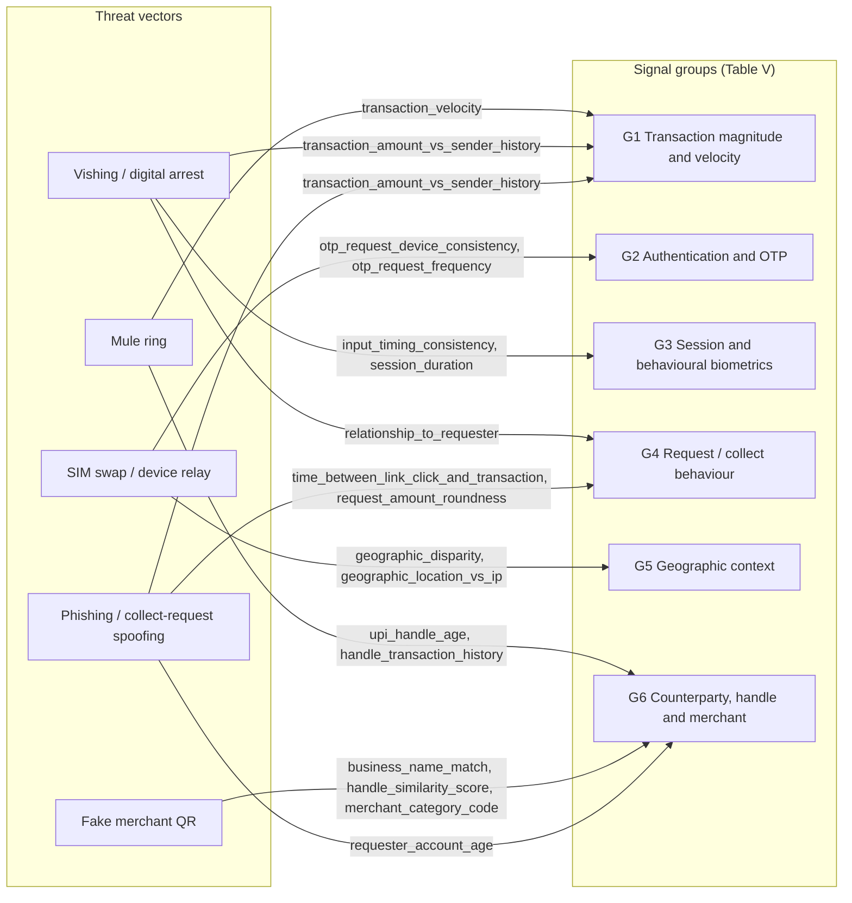
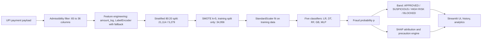
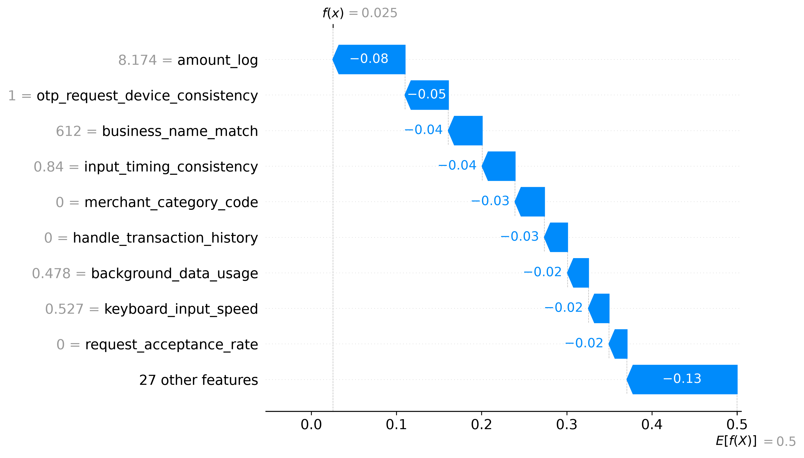

# UPI Fraud Shield ML: A Leakage-Resistant, Explainable Machine Learning Framework for Real-Time UPI Payment Fraud Detection and Pre-Authorization Risk Stratification

**Author 1, Author 2, Author 3, Author 4**
Department of Computer Science / Information Technology, [Institution Name], India
Email: [author emails]

## Abstract

The Unified Payments Interface (UPI) clears more than twelve billion transactions per month over irrevocable, 24×7 account-to-account rails, which compresses the window for fraud interdiction to the instant preceding authorization. This paper presents **UPI Fraud Shield ML**, a leakage-resistant and explainable machine-learning framework for pre-authorization risk stratification of UPI payments. The work (i) formalizes an *admissibility criterion* and a three-class taxonomy of target leakage (post-event, generator-coupled, identifier-proxy) and applies it to a 26,393-record, 65-column synthetic transaction corpus (21,848 legitimate; 4,545 fraudulent), retaining 36 engineered pre-authorization predictors in six signal categories; (ii) confines SMOTE ($k=5$) strictly to the stratified 80% training split (21,114 → 34,956 records) so that the 5,279-record test set (909 fraud) retains its native prevalence of 17.22%; and (iii) benchmarks Logistic Regression, CART, Random Forest, Gradient Boosting and a 64-32-16 MLP. Gradient Boosting attains F1 = 99.95% (1 FP, 0 FN); the deployed Random Forest attains F1 = 99.89% (2 FP, 0 FN, ROC-AUC 1.0000). An exact McNemar analysis shows that this difference cannot be distinguished from chance ($p = 1.0$). The linear baseline already reaches ROC-AUC 0.9999, which is read here as evidence of near-linear *synthetic separability* rather than deployable accuracy: at unchanged error rates, Random Forest precision falls from 99.78% at the corpus prevalence to 68.6% at 0.1% prevalence. Model outputs are mapped to four risk bands (<20%, 20–<50%, 50–<80%, ≥80%) and accompanied by local SHAP attributions and a rule-based precaution engine. The paper closes with a threat model, a validity audit, calibration and out-of-time validation protocols, and an enterprise streaming roadmap.

**Index Terms** — UPI fraud detection, pre-authorization risk scoring, target leakage, SMOTE, explainable AI, SHAP, probability calibration, cost-sensitive learning

---

## I. Introduction and the UPI Payment Ecosystem

### I.1 Rails, addressing and settlement

UPI is layered on the Immediate Payment Service (IMPS) interbank switching infrastructure operated by the National Payments Corporation of India (NPCI) [45]. A payer's PSP application resolves a virtual payment address (VPA, of the form `name@handle`) to an underlying account through a central mapper; the payer authorizes the debit with a UPI PIN verified by the issuing bank; and the debit and credit legs settle in near-real time, every hour of every day. Three properties of this design shape the fraud problem. First, *settlement is effectively irrevocable*: recovery of a credited amount depends on receiver-side cooperation and post-hoc dispute workflows rather than on a scheme-mediated chargeback. Second, *VPAs decouple identity from account number*, lowering the cost of creating and rotating receiver identities. Third, *both pull and push flows exist*: a collect request lets a requester initiate a pull that the payer merely approves, which attackers exploit by disguising a debit as an incoming credit.

### I.2 Pre-authorization versus post-authorization regimes

Card-present and card-not-present regimes can tolerate a layered, partly retrospective control stack: authorization-time scoring, followed by chargeback and representment windows that redistribute losses after the fact. On irrevocable instant rails this second layer largely disappears, so the *only* control point with high marginal value is the interval between payload receipt and authorization. A pre-authorization scorer must therefore (a) use only information determinable before authorization (Section IV), (b) return within a latency budget compatible with the payment flow (Sections XI and XIII), and (c) emit a graded action — approve, step-up, hold or block — rather than a binary label, because the cost of a wrongful block on an instant rail is borne immediately by a legitimate user.

### I.3 Threat vectors

Five vectors dominate the operational picture and are used throughout this paper as the organizing taxonomy for feature design and test cases.

1. **SIM-swap and device-relay attacks.** Device binding in UPI applications relies on verification through the registered mobile number. An attacker who obtains a duplicate SIM can bind the victim's VPA on an attacker-controlled handset and receive OTPs, producing OTP–device inconsistency and geographic or IP disparity.
2. **Collect-request spoofing.** A collect request is presented as a payment "to receive money" or as a refund; the victim approves and enters a PIN, authorizing a *debit*. Signals include a young requester account, rapid link-to-transaction timing and round, high amounts relative to sender history.
3. **Fake merchant QR substitution.** A legitimate merchant's QR is overlaid with an attacker's QR, so the payer authorizes a payment to a handle whose name, category and transaction history do not match the claimed business.
4. **Social-engineering vishing.** The attacker coaches the victim by phone through authorizing the transfer. Because the *victim* operates the device, device-consistency and biometric signals look legitimate; detection must lean on contextual and counterparty deviation and on interaction hesitation.
5. **Digital-arrest scams and mule rings.** Victims are coerced, under impersonated law-enforcement pressure, into pushing large transfers to "verification" accounts that belong to a network of mules, which then fan funds out through short cyclic paths.

### I.4 Rule engines, machine learning and the case for behavioral signals and XAI

Deterministic rule engines (amount ceilings, velocity limits, blacklists) are transparent, cheap and auditable, but they encode the assumptions of their authors and degrade silently as attackers adapt [8], [51]. Supervised learners estimate $P(y=1\mid\mathbf{x})$ from labeled history and capture conjunctions that rules miss — for example, a large amount that is unremarkable alone but suspicious combined with an OTP–device mismatch. Because no single channel is reliable (attackers control some features and victims control others), the framework fuses transaction, authentication, session/behavioral, request, geographic and counterparty signals. Because those fused scores affect real payments, they must be explainable to analysts, auditors and customers: a probability without a reason cannot be debugged, challenged or governed [2], [16].

### I.5 Contributions

1. **Leakage-resistance protocol.** A formal admissibility criterion and a three-class leakage taxonomy, with a documented audit that removes receiver-profile and PIN-method variables that were synthetically coupled to the label (Section IV).
2. **A 36-feature, six-category pre-authorization representation** with a training pipeline in which SMOTE, scaling and encoding are fit exclusively on training data, together with an explicit prior-shift correction needed to map balanced-training probabilities onto operational risk bands (Sections V and XII).
3. **A rigorously analyzed benchmark** of five model families on a pristine test set, including exact confusion-matrix decomposition, Pareto cost-dominance analysis, prevalence-shifted precision, exact paired tests and a pre-specified ablation and sensitivity protocol (Sections VII and VIII).
4. **An integrated explainability-and-precaution layer** pairing Shapley attributions with percentile-specified heuristic alerts, three end-to-end traces mapped to named threat vectors, and a latency-profiling protocol (Sections IX–XI).
5. **A threat model, validity audit and enterprise roadmap** that states, rather than conceals, the limits of near-perfect synthetic scores, and ships a reproducibility harness that regenerates every pending measurement (Sections II, XII, XIII and Appendix B).

---

## II. Threat Modeling and Problem Formulation

### II.1 Notation and learning problem

Let $\mathcal{D}=\{(\mathbf{x}_i,y_i)\}_{i=1}^{N}$ with $N=26{,}393$, where $\mathbf{x}_i\in\mathbb{R}^{36}$ is the encoded pre-authorization feature vector and $y_i\in\{0,1\}$ indicates fraud ($y=1$). The empirical fraud prevalence is

$$\pi=\frac{4545}{26393}=0.17220\ (17.22\%),\qquad \frac{\pi}{1-\pi}=\frac{4545}{21848}=0.20803. \tag{1}$$

A model is a score function $f_\theta:\mathbb{R}^{36}\to\mathbb{R}$ with posterior estimate $\hat p(\mathbf{x})=\sigma(f_\theta(\mathbf{x}))$, $\sigma(u)=1/(1+e^{-u})$ (for ensembles, $\hat p$ is the averaged or boosted class-1 probability). A decision rule is $\hat y(\mathbf{x})=\mathbb{1}[\hat p(\mathbf{x})\ge t]$.

### II.2 Bayesian cost-sensitive objective

Let $C_{\text{FN}}$ be the loss from an undetected fraud and $C_{\text{FP}}$ the loss from interrupting a legitimate payment, with zero cost for correct decisions. The empirical cost-sensitive logistic objective is

$$\mathcal{L}(\theta)=\sum_{i=1}^{N}\Big[y_i\,C_{\text{FN}}\log\!\big(1+e^{-f_\theta(\mathbf{x}_i)}\big)+(1-y_i)\,C_{\text{FP}}\log\!\big(1+e^{f_\theta(\mathbf{x}_i)}\big)\Big]. \tag{2}$$

For a calibrated posterior $q(\mathbf{x})=P(y=1\mid\mathbf{x})$, the Bayes-optimal rule minimizes expected cost, $q\,C_{\text{FN}}\ \lessgtr\ (1-q)\,C_{\text{FP}}$, giving the threshold

$$t^\star=\frac{C_{\text{FP}}}{C_{\text{FP}}+C_{\text{FN}}}=\frac{1}{1+\rho},\qquad \rho\equiv\frac{C_{\text{FN}}}{C_{\text{FP}}}. \tag{3}$$

Three consequences matter for this study.

*(a) `class_weight='balanced'` is an implicit threshold.* Scikit-learn's balanced weights set $w_1/w_0=n_0/n_1$. On the native data this is $21848/4545=4.807$, so $\rho=4.807$ and $t^\star=1/(1+4.807)=0.1722=\pi$: balanced weighting implicitly moves the Bayes threshold to the base rate. On the SMOTE-balanced training set ($n_0=n_1=17{,}478$) the balanced weights are $34956/(2\cdot17478)=1.0$ for both classes, so **the `class_weight='balanced'` argument is a no-op once the models are fit on SMOTE-resampled data** (Section V.3 discusses the consequence).

*(b) The four risk bands encode cost asymmetries.* Reading the band edges through Eq. (3), a threshold of $t=0.2$ corresponds to $\rho=4$, $t=0.5$ to $\rho=1$ and $t=0.8$ to $\rho=0.25$. A step-up challenge at 20% is therefore optimal when a missed fraud costs at least four times a challenge friction; a block at 80% is optimal only when a wrongful block is at least four times as costly as a missed fraud. These are interface-level choices, not regulatory thresholds, and they are meaningful only if $\hat p$ is calibrated to the operational prevalence (Section XII.4).

*(c) Prior shift.* If the classifier is trained at prior $\pi_s$ but deployed at prior $\pi_d$, the Bayes-consistent correction rescales the posterior odds,

$$\frac{q_d}{1-q_d}=\frac{\hat p_s}{1-\hat p_s}\cdot\frac{\pi_d/(1-\pi_d)}{\pi_s/(1-\pi_s)}. \tag{4}$$

For SMOTE-balanced training, $\pi_s=0.5$, so odds are multiplied by $\pi_d/(1-\pi_d)$; at the corpus prevalence this factor is $0.20803$, and at 0.1% deployment prevalence it is $0.001001$. Uncorrected SMOTE-trained probabilities systematically overstate risk and would push traffic into higher bands.

### II.3 Risk-band operator

$$\mathcal{B}(p)=\begin{cases}\text{APPROVED}&p<0.20\\ \text{SUSPICIOUS}&0.20\le p<0.50\\ \text{HIGH RISK}&0.50\le p<0.80\\ \text{BLOCKED}&p\ge 0.80\end{cases}\tag{5}$$

### II.4 Adversary model

The feature vector is partitioned by *who controls it*: $\mathbf{x}=(\mathbf{x}_A,\mathbf{x}_V,\mathbf{x}_S)$, where $\mathbf{x}_A$ is attacker-controllable (request cadence, amount, handle attributes), $\mathbf{x}_V$ is victim-generated (typing speed, device, session) and $\mathbf{x}_S$ is system-immutable within a session (sender history, account age). An evasion attack against a deployed scorer solves

$$\min_{\boldsymbol\delta\in\Delta}\ \hat p(\mathbf{x}+\boldsymbol\delta)\quad\text{s.t.}\quad \operatorname{supp}(\boldsymbol\delta)\subseteq\mathcal{I}_A,\ \ \mathcal{U}(\mathbf{x}+\boldsymbol\delta)\ge u_{\min}, \tag{6}$$

where $\mathcal{I}_A$ indexes attacker-controllable features, $\Delta$ bounds feasible perturbations and $\mathcal{U}$ is the attacker's payoff (extracted value net of cost), which constrains how far amount and timing can be altered [46]. Table I specifies the four adversary classes considered.

**Table I. Adversary classes and capabilities**

| Class | Capability | Controls | Cannot control | Dominant vector | Defensive implication |
|---|---|---|---|---|---|
| A1 Scripted automation | High-rate scripted requests; black-box probing of the scorer; parameter tuning within budget | Amount, request frequency/cadence, response timing, handle string | Sender history, victim device, OTP channel | Collect-request spoofing, fake QR | Rate-limit probing; avoid exposing exact rule cut-offs; rely on features in $\mathbf{x}_S$ |
| A2 Human-in-the-loop social engineer | Real-time coaching of the victim by voice | Victim's decision and, indirectly, timing and hesitation | Victim's device/OTP binding; receiver identity history | Vishing, digital arrest | Device and biometric features are *uninformative*; counterparty and amount-deviation signals carry the load |
| A3 Mule syndicate | Large pool of aged or purchased accounts; cyclic fan-out | Receiver-side handle, account age, rotation | Sender-side behavior | Mule rings | Receiver reputation and graph features (Section XIII.2) |
| A4 SIM-swap/device-relay | Possession of OTP channel on a new handset | OTP timing, device binding | Victim's historical device and location | Account takeover | OTP–device consistency, geographic and IP disparity |

The threat model assumes Kerckhoffs-style conditions: the adversary knows the feature families but not the learned parameters, and may issue a bounded number of probing transactions. Adaptive white-box attacks are out of scope and listed as future work.

*Fig. 2. Threat-vector-to-signal mapping. Edges list the principal features through which each vector becomes observable at authorization time.*

---

## III. Related Work and Comparative Taxonomy

**Rule-based and statistical baselines.** Early fraud-detection practice, and much of the surveyed literature, combines expert rules with statistical outlier detection and supervised classification [8], [13], [14], [51]. These surveys establish the recurrent difficulties — extreme class imbalance, delayed and noisy labels, cost asymmetry and adversarial drift — but pre-date contemporary gradient-boosted ensembles and post-hoc explanation methods.

**Classical and ensemble machine learning.** Logistic regression remains the transparent baseline [37]. Bagged and boosted tree ensembles [3], [4], [5], [6] dominate tabular benchmarks, and recent evidence indicates that tree ensembles still outperform deep architectures on typical medium-sized tabular data [35]. In card fraud, practitioner studies emphasize that delayed labels, concept drift and alert-budget constraints, rather than raw classifier choice, determine operational value [10], and that probability calibration interacts with rebalancing strategy [9]. Realistic modeling and learning-strategy work further shows that evaluation must respect the temporal structure of fraud streams [11], and that engineered aggregates and periodic behavioral features materially improve cost-sensitive performance [12].

**Imbalance handling.** SMOTE generates minority examples by interpolation between a minority sample and one of its $k$ nearest minority neighbors [1], with maintained implementations in `imbalanced-learn` [49]. Because interpolation is performed in feature space, it is sensitive to feature scaling and to nominal encodings (Section V.3).

**Calibration and cost.** Platt scaling [19], isotonic regression [20], and the comparison of calibration behavior across model families [21], [22] provide the toolkit for turning scores into probabilities; the Brier score [23] and expected calibration error quantify the result. Cost-sensitive decision theory [24] and the precision–recall view of imbalanced evaluation [25]–[27] justify reporting more than ROC-AUC.

**Leakage and explanation.** Kaufman et al. formalize target leakage as the use of information in training that will be unavailable or differently distributed at prediction time [28]. SHAP unifies additive feature-attribution methods under the Shapley value [2], [17], and its tree-specialized algorithm computes exact attributions in polynomial time [16]; LIME is a model-agnostic local-surrogate alternative [18].

**Sequence and graph models.** Recurrent [31] and temporal-convolutional [32] architectures model transaction sequences; graph convolutional networks [33] have been applied to illicit-transaction graphs [34].

The authors are not aware of a public UPI-native dataset with behavioral telemetry; privacy and commercial constraints plausibly explain the gap, and it motivates the synthetic-data caveats of Section XII. Table II positions the present study relative to representative prior work.

**Table II. Comparative taxonomy of representative studies**

| Study | Dataset scale | Feature domain | Model family | Explainability | Real-time SLA | Critical vulnerability |
|---|---|---|---|---|---|---|
| Bolton & Hand [8] | Survey (no single dataset) | Card, telecom, insider fraud | Statistical, outlier and supervised methods | Not addressed | Not addressed | Pre-dates ensemble and XAI era; no leakage protocol |
| Dal Pozzolo et al. [10] | Real card transactions (industrial partner) | Transaction aggregates | Ensembles under practitioner constraints | Not addressed | Discusses delayed-label and alert-budget constraints | Proprietary data; not reproducible |
| Dal Pozzolo et al. [9] | Public card subset (284,807 transactions; 492 frauds) | PCA-anonymized components, amount, time | Undersampling with calibration correction | None (anonymized features) | Not reported | Obfuscated features preclude semantic explanation; short observation window |
| Bahnsen et al. [12] | Real card data (proprietary) | Aggregated and periodic behavioral features | Cost-sensitive classifiers | Not addressed | Not reported | Proprietary; no public replication |
| Chen & Guestrin [6] | General benchmarks | Generic tabular | Boosted trees | Gain-based importance | Not fraud-specific | Importance is global and non-causal |
| Liu et al. [7] | General benchmarks | Generic tabular | Isolation Forest (unsupervised) | Not addressed | Linear-time scoring | Ignores labels; threshold unanchored |
| Weber et al. [34] | Illicit-transaction graph (203,769 nodes; 234,355 edges) | Graph and node features | GCN | Limited | Not reported | Cryptocurrency AML, not instant-payment rails |
| Lundberg et al. [16] | Medical and general tabular | Generic | Tree SHAP | Exact local attributions | Polynomial-time algorithm | Not validated on fraud streams |
| **This study** | 26,393 × 65 synthetic UPI corpus (36 features) | Transaction, authentication, session/behavioral, request, geographic, counterparty | LR, CART, RF, GB, MLP | SHAP plus rule-based precaution engine | Profiling protocol and budget specified (XI, XIII); measurements pending | Synthetic near-linear separability; random split only |

---

## IV. Data Quality, Leakage Screening and Feature Architecture

### IV.1 Corpus

**Table III. Dataset and partition summary (G)**

| Quantity | Value |
|---|---|
| Source file | `fraud_dataset.csv` (synthetic) |
| Records / raw columns | 26,393 / 65 |
| Target | `is_fraud` ($y=1$ fraud) |
| Legitimate / fraudulent | 21,848 (82.78%) / 4,545 (17.22%) |
| Columns removed | 28 (identifiers, post-event and generator-coupled variables, high-correlation variable, list-type fields); $65-36-1=28$ |
| Final predictors | 36 |
| Train / test (80:20, stratified, `random_state=42`) | 21,114 / 5,279 |
| Train legitimate / fraud (pre-SMOTE) | 17,478 / 3,636 |
| Test legitimate / fraud | 4,370 / 909 |
| Train after SMOTE | 34,956 (17,478 per class; 13,842 synthetic) |

The partition is internally consistent: $17{,}478+3{,}636=21{,}114$; $4{,}370+909=5{,}279$; $3{,}636+909=4{,}545$; and $34{,}956-21{,}114=13{,}842$ synthetic minority records.

### IV.2 Leakage screening audit

**Admissibility criterion.** Let $\tau$ denote the authorization instant and $\mathcal{F}_{\tau^-}$ the information available strictly before it. A feature $X_j$ is *admissible* iff

$$\text{(i)}\ \ X_j\ \text{is}\ \mathcal{F}_{\tau^-}\text{-measurable}\quad\text{and}\quad \text{(ii)}\ \ P_{\text{train}}(X_j\mid y)=P_{\text{deploy}}(X_j\mid y). \tag{7}$$

Condition (i) excludes information that exists only after the event; condition (ii) excludes features whose relationship to the label is an artifact of the data-generating process. Three leakage classes follow.

**Table IV. Leakage taxonomy and audit outcome**

| Class | Violates | Examples in this corpus | Disposition |
|---|---|---|---|
| I Post-event | (i) | Post-event variables identified in the notebook | Removed |
| II Generator-coupled | (ii) | `receiver_account_age`, `receiver_transaction_history` (synthetically generated with strong dependence on the label); `pin_entry_method` (correlation ≈ 0.524 with the target in an earlier iteration) | Removed |
| III Identifier / proxy | Both (high-cardinality identity proxies) | `transaction_id`, `user_id`, `merchant_id`, `timestamp`, `device_id`, IP address, location, URL referrer, descriptive text | Removed |
| — List-type fields | Non-informative | String-stored lists with effectively no variance | Removed |

**Why leakage produces deceptive near-100% metrics.** Suppose a generator-coupled column satisfies $X_L=a\,y+\varepsilon$, $\varepsilon\sim\mathcal{N}(0,\sigma^2)$. Its single-feature ROC-AUC is $\Phi\!\big(a/(\sigma\sqrt2)\big)$. For $a/\sigma=5$ the AUC is $\Phi(3.54)=0.9998$ and the threshold classifier at $a/2$ has error $\Phi(-2.5)=0.62\%$: one leaked column suffices to reproduce the "perfect" scores. The inflation is invisible to any evaluation that splits randomly from the *same generator*, because train and test share $P(X_L\mid y)$. At deployment, where condition (ii) fails, the learned dependence on $X_L$ becomes noise and performance reverts toward the Bayes risk achievable from the remaining columns, $R^\star(\mathbf{X}_{c})$, which satisfies $R^\star(\mathbf{X}_c,X_L)\le R^\star(\mathbf{X}_c)$ only under the training distribution.

**Screening statistic.** For binary $y$ with prevalence $\pi$, the point-biserial correlation of a feature with mean shift $a$ and noise $\sigma$ is $r=a\sqrt{\pi(1-\pi)}\big/\sqrt{a^2\pi(1-\pi)+\sigma^2}$. Inverting at the reported $r=0.524$ and $\pi=0.1722$ gives $a/\sigma=1.63$, i.e., a single-feature AUC of $\Phi(1.63/\sqrt2)\approx0.875$ *under the equal-variance Gaussian-shift assumption* (D). A column of this strength is not leaky by itself, but alongside the receiver-profile columns it was retained as a conservative removal, consistent with a screening rule that flags $|r|\gtrsim0.5$ for provenance review.

The notebook records that the pipeline before this audit produced approximately perfect accuracy, and that the audited pipeline *still* produces near-perfect scores. Section XII.1 treats this persistence as a finding in its own right.

### IV.3 Final feature space: 36 predictors in six signal categories

Group assignment is by operational semantics. Data types are inferred from feature meaning; "cat" denotes a `LabelEncoder`-mapped nominal column (Draft 1 states that object-valued predictors are label-encoded) and must be confirmed with `--task dictionary`. Columns F34–F36 are not recoverable from Draft 1 (Appendix A).

**Table V. Feature architecture (33 named + 3 unresolved)**

| Feature | Description | Data type | Transformation | Operational signal |
|---|---|---|---|---|
| **G1 — Transaction magnitude and velocity** | | | | |
| `amount_log` | Log-compressed transaction amount | float | $\ln(1+\max(0,x))$ | Absolute magnitude; top RF importance (0.188) |
| `transaction_amount_vs_sender_history` | Amount relative to the sender's historical norm | float ratio | none | Personalized deviation; collect/vishing |
| `transaction_velocity` | Recent transaction rate | numeric | none | Mule fan-out, burst drains |
| `failed_transaction_count` | Recent failed attempts | integer | none | Credential/PIN guessing |
| `transaction_type` | Payment mode (e.g., P2P, merchant) | cat | LabelEncoder | Context for expected amount and behavior |
| **G2 — Authentication and OTP** | | | | |
| `authentication_attempts` | Attempts within the session | integer | none | Brute force, coached retries |
| `authorization_method` | Authorization mechanism used | cat | LabelEncoder | Weak-factor fallback |
| `otp_request_frequency` | OTP requests per window | integer | none | OTP harvesting, relay |
| `otp_request_device_consistency` | OTP requested from the enrolled device | numeric/binary | none | SIM-swap / relay; RF importance 0.093 |
| `time_between_otp_generation_and_input` | OTP generation-to-entry delay | seconds | none | Remote relay vs. in-hand entry |
| **G3 — Session and behavioral biometrics** | | | | |
| `session_duration` | Session length | seconds | none | Hesitation, remote coaching |
| `screen_active_time` | Active screen time | seconds | none | Passive/remote operation |
| `keyboard_input_speed` | Typing speed | numeric | none | Operator change, automation |
| `app_switching_frequency` | App switches during session | integer | none | Simultaneous call/chat (vishing) |
| `input_timing_consistency` | Regularity of input timings | numeric | none | Scripted or coached input; RF importance 0.078 |
| `pin_entry_speed` | PIN entry speed | numeric | none | Operator change |
| `background_data_usage` | Background data activity | numeric | none | Screen-sharing / remote-access tooling |
| **G4 — Request / collect behavior** | | | | |
| `request_frequency` | Incoming payment requests per window | integer | none | Collect-spam |
| `request_acceptance_rate` | Historical acceptance rate | float | none | Susceptibility context |
| `time_to_respond_to_request` | Delay before approving a request | seconds | none | Rushed approval under pressure |
| `request_amount_roundness` | Roundness of requested amount | numeric | none | Scripted amounts |
| `time_between_link_click_and_transaction` | Link-click-to-payment delay | seconds | none | Phishing link flows |
| `relationship_to_requester` | Declared relation to requester | cat | LabelEncoder | Known vs. unknown counterparty |
| **G5 — Geographic context** | | | | |
| `geographic_disparity` | Distance from usual locations | numeric | none | Account takeover |
| `geographic_location_vs_ip` | Agreement of GPS and IP location | numeric/binary | none | Proxy/relay |
| **G6 — Counterparty, handle and merchant** | | | | |
| `requester_account_age` | Age of requester account | days | none | Fresh mule/scam accounts |
| `upi_handle_age` | Age of the VPA handle | days | none | Handle rotation |
| `handle_similarity_score` | Similarity to a legitimate handle | float | none | Look-alike impersonation |
| `handle_contains_official_terms` | Handle embeds "official"-style tokens | binary | none | Authority spoofing |
| `handle_transaction_history` | Prior transaction history of the handle | numeric | none | Receiver reputation; RF importance 0.063 |
| `business_name_match` | Claimed vs. registered business name | numeric/binary | none | Fake-QR substitution; RF importance 0.087 |
| `social_media_presence` | Counterparty online footprint | numeric/binary | none | Merchant legitimacy |
| `merchant_category_code` | Merchant category | cat | LabelEncoder | Category-conditional norms |
| F34–F36 | Three columns not named in Draft 1 | — | — | Read from `feature_cols.pkl` |

---

## V. Proposed System Architecture and Preprocessing Pipeline

### V.1 End-to-end workflow

*Fig. 1. End-to-end pipeline. At inference the same encoders, feature order and scaler are loaded from serialized artifacts; SMOTE is never applied.*

**Table VI. Stage-by-stage trace**

| Stage | Operation | Artifact | Training vs. inference |
|---|---|---|---|
| 1 | Ingest payload fields | — | Both |
| 2 | Drop identifier, leakage, high-correlation and list columns (only those present) | — | Training |
| 3 | $z=\ln(1+\max(0,x))$ on amount | — | Both |
| 4 | Encode nominal columns; unseen category → first known class | `label_encoders.pkl` | Both |
| 5 | Order columns | `feature_cols.pkl` | Both |
| 6 | Stratified split, `random_state=42` | — | Training |
| 7 | SMOTE ($k=5$, `random_state=42`) on training split only | — | Training |
| 8 | StandardScaler fit on the SMOTE-balanced training set; transform test | `scaler.pkl` | Scaled models only |
| 9 | `predict_proba` → class-1 probability $p$ → band $\mathcal{B}(p)$ (Eq. 5) | `best_model.pkl` | Both |
| 10 | SHAP and precaution rules | — | Inference |

### V.2 Amount transformation

Transaction amounts are heavy-tailed. With $x\ge0$,

$$z=\ln\!\big(1+\max(0,x)\big). \tag{8}$$

If amounts are approximately log-normal, $\ln x$ is approximately normal and the skewness of $z$ is near zero; Eq. (8) is the $\lambda\to0$ limit of the Box–Cox family, defined at $x=0$ and strictly monotone. Two consequences are worth stating. Tree models are invariant to strictly monotone transforms, so $z$ affects only the linear and neural models and the geometry of SMOTE interpolation. And because interpolation is linear in $z$, a synthetic amount lies on the *geometric* path between two real amounts, which is the desired behavior for a multiplicative quantity.

### V.3 Class imbalance and SMOTE

For a minority sample $\mathbf{x}_i$ and a neighbor $\mathbf{x}_{nn}$ drawn uniformly from its $k=5$ nearest minority neighbors,

$$\mathbf{x}_{\text{new}}=\mathbf{x}_i+\lambda\,(\mathbf{x}_{nn}-\mathbf{x}_i),\qquad\lambda\sim\mathcal{U}(0,1). \tag{9}$$

The pipeline generates $17{,}478-3{,}636=13{,}842$ synthetic fraud records.

**Why SMOTE must be isolated to the training split.** If oversampling preceded the split, synthetic points would be interpolated from instances that later fall in the test set. A synthetic point $s$ on the segment $[\mathbf{x}_t,\mathbf{x}_{nn}]$ satisfies $\lVert s-\mathbf{x}_t\rVert\le(1-\lambda)\lVert\mathbf{x}_{nn}-\mathbf{x}_t\rVert$, so the training set would contain near-duplicates of test minority points, and a high-capacity model would be rewarded for memorization. Fitting SMOTE after the split removes this path and leaves test prevalence at 17.22%.

**Three caveats that the baseline pipeline inherits.**

1. *`class_weight='balanced'` is inert after SMOTE.* With $n_0=n_1$ the balanced weights are exactly 1 (Section II.2a). If the five models were fit on the resampled set, as the scaler fit implies, rebalancing is performed by SMOTE alone.
2. *Neighbor search on unscaled, label-encoded features.* Because the scaler is fitted *after* SMOTE, $k$-NN distances in Eq. (9) are dominated by large-range columns (e.g., durations), and interpolating between integer codes of a nominal column (G1 `transaction_type`, G2 `authorization_method`, G4 `relationship_to_requester`, G6 `merchant_category_code`) produces fractional codes that correspond to no category. SMOTE-NC or scale-then-SMOTE within an `imblearn` pipeline [49] removes both issues; the ablation protocol (Section VIII) includes this variant.
3. *Early-stopping validation leakage in the MLP.* With `early_stopping=True` and `validation_fraction=0.15`, the validation subset is drawn from the *resampled* training set, so synthetic points near their real parents appear on both sides of that internal split and make early stopping optimistic.

### V.4 Categorical encoding and scaling discipline

`LabelEncoder` maps each nominal level to an integer; encoders are serialized and reused at inference. When an unseen category arrives, the application maps it to the encoder's first known class so that inference does not raise. This prevents a crash but silently assigns the unseen value to a specific real category, which can mask exactly the novel behavior fraud analysts care about; production systems should reserve an explicit `UNK` level and monitor its rate as a drift signal (Section XIII.3).

The `StandardScaler` computes $\mu_j,\sigma_j$ on the SMOTE-balanced training set and applies $\tilde x_j=(x_j-\mu_j)/\sigma_j$ to test and inference rows without refitting. Because synthetic points shift the moments, the deployed scaler differs slightly from one fit on the native training split; this does not leak test information, but it is part of the "model contract" (Appendix B) and must be versioned with the model. Only Logistic Regression and the MLP consume scaled inputs; the three tree-based models are scale-invariant.

---

## VI. Machine Learning Model Framework

All five classifiers consume the same 36-column representation. Parameters not stated in Draft 1 take scikit-learn [15] defaults and are listed as such in Appendix B.

### VI.1 Regularized Logistic Regression

The model is $\hat p(\mathbf{x})=\sigma(\mathbf{w}^\top\mathbf{x}+b)$ with the log-odds interpretation $\log\frac{\hat p}{1-\hat p}=\mathbf{w}^\top\mathbf{x}+b$ [37]. Scikit-learn minimizes

$$\min_{\mathbf{w},b}\ \tfrac12\lVert\mathbf{w}\rVert_2^2+C\sum_{i=1}^{n}s_i\log\!\big(1+e^{-\tilde y_i(\mathbf{w}^\top\mathbf{x}_i+b)}\big),\quad \tilde y_i\in\{-1,+1\}, \tag{10}$$

with $C=0.5$ and per-sample weights $s_i$ from `class_weight='balanced'`. Smaller $C$ means stronger shrinkage; $C=0.5$ is moderate regularization. Eq. (10) is the weighted special case of Eq. (2) with an L2 penalty.

### VI.2 CART Decision Tree

At node $t$ with class proportions $p_k(t)$, Gini impurity is $G(t)=1-\sum_k p_k(t)^2$ [29]. The split $(j,s)$ maximizes

$$\Delta G=G(t)-\tfrac{n_L}{n_t}G(t_L)-\tfrac{n_R}{n_t}G(t_R). \tag{11}$$

Capacity is bounded by `max_depth=6` (at most $2^6=64$ leaves) and `min_samples_leaf=20`; balanced weights enter the proportions $p_k$.

### VI.3 Random Forest

A forest averages $T=200$ trees grown on bootstrap samples with random feature subsets at each split [3]. For identically distributed trees of variance $\sigma^2$ and pairwise correlation $\rho_c$,

$$\operatorname{Var}\Big(\tfrac1T\sum_{t=1}^{T}h_t(\mathbf{x})\Big)=\rho_c\,\sigma^2+\frac{1-\rho_c}{T}\sigma^2, \tag{12}$$

so bagging reduces variance toward the floor $\rho_c\sigma^2$, and feature subsampling lowers $\rho_c$. With the library default `max_features='sqrt'`, each split considers $\lceil\sqrt{36}\rceil=6$ candidate features (default assumed; confirm against the notebook). Reported importances are mean decrease in impurity (MDI), the normalized sum of weighted Gini decreases (Eq. 11) over all splits on a feature; MDI is known to favor continuous and high-cardinality predictors [41], which is relevant to `amount_log` ranking first.

### VI.4 Gradient Tree Boosting

Stagewise additive modeling [4] with shrinkage $\nu=0.08$ and row subsampling 0.8 (stochastic gradient boosting [5]):

$$F_m(\mathbf{x})=F_{m-1}(\mathbf{x})+\nu\,\gamma_m h_m(\mathbf{x}),\qquad r_{im}=y_i-\sigma\big(F_{m-1}(\mathbf{x}_i)\big), \tag{13}$$

where $h_m$ is a depth-4 regression tree fit to the pseudo-residuals $r_{im}$ (the negative gradient of the log-loss) and, for each leaf, the Newton step is $\gamma=\sum r_i/\sum p_i(1-p_i)$. With $M=150$ stages, `min_samples_leaf=15`. Smaller $\nu$ with more stages trades training time for lower variance.

### VI.5 Multi-Layer Perceptron

The network is $36\to64\to32\to16\to1$ with ReLU hidden activations and a logistic output (library defaults for unspecified settings, including the Adam optimizer [50]). Parameter count: $36{\cdot}64+64{\cdot}32+32{\cdot}16+16{\cdot}1=4{,}880$ weights plus $64+32+16+1=113$ biases, i.e., **4,993 parameters**. The objective is cross-entropy plus L2 weight decay,

$$J(\mathbf{W})=-\frac1n\sum_i\big[y_i\log\hat p_i+(1-y_i)\log(1-\hat p_i)\big]+\frac{\alpha}{2n}\sum_\ell\lVert W^{(\ell)}\rVert_F^2,\quad\alpha=0.01, \tag{14}$$

minimized by backpropagation [30]: $\boldsymbol\delta^{(L)}=\hat p-y$, $\boldsymbol\delta^{(\ell)}=\big(W^{(\ell+1)\top}\boldsymbol\delta^{(\ell+1)}\big)\odot\phi'(\mathbf{a}^{(\ell)})$, $\nabla_{W^{(\ell)}}J=\boldsymbol\delta^{(\ell)}\mathbf{h}^{(\ell-1)\top}+\tfrac{\alpha}{n}W^{(\ell)}$. Training stops when the internal validation score ($15\%$ of the training data) stops improving, up to 300 iterations.

**Table VII. Model configuration (G for hyperparameters; complexity is standard analysis)**

| Model | Hyperparameters | Feature scale | Training time | Inference time |
|---|---|---|---|---|
| Logistic Regression | $C=0.5$, `class_weight='balanced'`, `max_iter=1000`, `random_state=42` | Scaled | $O(I\,n\,d)$ ($I\le1000$ iterations) | $O(d)$ |
| Decision Tree | `max_depth=6`, `min_samples_leaf=20`, balanced | Unscaled | $O(d\,n\log n)$ | $O(D)=O(6)$ |
| Random Forest | 200 trees, `max_depth=8`, `min_samples_leaf=10`, balanced, `random_state=42`, all cores | Unscaled | $O(T\,d'\,n\log n)$, $d'=6$ (parallel over $T$) | $O(T\,D)=O(1{,}600)$ node tests |
| Gradient Boosting | 150 estimators, `learning_rate=0.08`, `max_depth=4`, `min_samples_leaf=15`, `subsample=0.8` | Unscaled | $O(M\,d\,n\log n)$, sequential in $M$ | $O(M\,D)=O(600)$ |
| MLP | 64-32-16, `alpha=0.01`, `max_iter=300`, `early_stopping=True`, `validation_fraction=0.15` | Scaled | $O(E\,n\,P)$, $P=4{,}993$ | $O(P)\approx4{,}880$ MACs |

Here $n$ is the number of training records (34,956 after SMOTE), $d=36$, $D$ is tree depth and $E$ the number of epochs.

---

## VII. Experimental Setup, Benchmarking and Results

### VII.1 Protocol and metrics

All models are evaluated on the untouched 5,279-record test set (909 fraud) at the default 0.5 threshold; SMOTE, the scaler and encoders are fitted on training data only. With $TP,FP,TN,FN$ from the confusion matrix:

$$\text{Acc}=\tfrac{TP+TN}{TP+TN+FP+FN},\quad \text{Prec}=\tfrac{TP}{TP+FP},\quad \text{Rec}=\tfrac{TP}{TP+FN},\quad F_1=\tfrac{2\,\text{Prec}\cdot\text{Rec}}{\text{Prec}+\text{Rec}}=\tfrac{2TP}{2TP+FP+FN}, \tag{15}$$

$$\text{AUC}=\Pr\big[\hat p(\mathbf{x}^+)>\hat p(\mathbf{x}^-)\big]+\tfrac12\Pr\big[\hat p(\mathbf{x}^+)=\hat p(\mathbf{x}^-)\big]. \tag{16}$$

Derived quantities used below are $\text{FPR}=FP/(TN+FP)$, $\text{FNR}=FN/(TP+FN)$ and the Matthews correlation coefficient

$$\text{MCC}=\frac{TP\cdot TN-FP\cdot FN}{\sqrt{(TP+FP)(TP+FN)(TN+FP)(TN+FN)}}. \tag{17}$$

### VII.2 Benchmark matrix

**Table VIII. Test-set performance (G; verified against Table IX by Eq. 15)**

| Model | Accuracy | Precision | Recall | F1 | ROC-AUC |
|---|---|---|---|---|---|
| Logistic Regression | 99.66% | 99.12% | 98.90% | 99.01% | 0.9999 |
| Decision Tree | 99.62% | 97.95% | 99.89% | 98.91% | 0.9993 |
| Random Forest (deployed) | 99.96% | 99.78% | 100.00% | 99.89% | 1.0000 |
| Gradient Boosting | 99.98% | 99.89% | 100.00% | **99.95%** | 1.0000 |
| MLP (64-32-16) | 99.89% | 99.45% | 99.89% | 99.67% | 1.0000 |

### VII.3 Confusion-matrix decomposition

**Table IX. Confusion cells (G) and derived error rates (D; 95% intervals are exact (Clopper–Pearson [38]), computed via the Poisson limit)**

| Model | TN | FP | FN | TP | FPR % [95% CI] | FNR % [95% CI] | MCC |
|---|---|---|---|---|---|---|---|
| Logistic Regression | 4,362 | 8 | 10 | 899 | 0.183 [0.079, 0.361] | 1.100 [0.527, 2.023] | 0.9880 |
| Decision Tree | 4,351 | 19 | 1 | 908 | 0.435 [0.262, 0.679] | 0.110 [0.003, 0.613] | 0.9869 |
| Random Forest | 4,368 | 2 | 0 | 909 | 0.046 [0.006, 0.165] | 0.000 [0, 0.405] | 0.9987 |
| Gradient Boosting | 4,369 | 1 | 0 | 909 | 0.023 [0.001, 0.128] | 0.000 [0, 0.405] | 0.9993 |
| MLP | 4,365 | 5 | 1 | 908 | 0.114 [0.037, 0.267] | 0.110 [0.003, 0.613] | 0.9960 |

Each row sums to 5,279 with $TN+FP=4{,}370$ and $FN+TP=909$. The error profiles are structurally different. Logistic Regression's errors are *recall-side* (10 missed frauds), the signature of a linear boundary clipping a non-linear tail. The Decision Tree is the opposite: it recovers 908/909 frauds but pays with 19 false alarms, the signature of coarse leaves (depth-6, $\le64$ regions) that absorb nearby legitimate points. The MLP is intermediate (5 FP, 1 FN). The two ensembles make no missed-fraud errors. For zero observed events, the 95% upper bound on FNR is 0.405% ($\approx$3.7 expected misses per 909 frauds); "0 FN" is therefore a statement about this test set, not about a rate.

### VII.4 Cost-sensitive comparison

Using Eq. (3), the expected cost of a model on the test set, in units of $C_{\text{FP}}$, is $\mathcal{C}(\rho)=\rho\cdot FN+FP$ (D).

**Table X. Cost in $C_{\text{FP}}$ units (D)**

| Model | Cost $\mathcal{C}(\rho)$ | $\rho=1$ | $\rho=5$ | $\rho=20$ | $\rho=100$ |
|---|---|---|---|---|---|
| Logistic Regression | $10\rho+8$ | 18 | 58 | 208 | 1,008 |
| Decision Tree | $\rho+19$ | 20 | 24 | 39 | 119 |
| MLP | $\rho+5$ | 6 | 10 | 25 | 105 |
| Random Forest | $2$ | 2 | 2 | 2 | 2 |
| Gradient Boosting | $1$ | 1 | 1 | 1 | 1 |

The error counts impose a *Pareto order independent of costs*: GB dominates RF (FN equal, 1 vs. 2 FP); RF dominates the MLP (0 vs. 1 FN and 2 vs. 5 FP); the MLP dominates both the Decision Tree (equal FN, 5 vs. 19 FP) and Logistic Regression (1 vs. 10 FN, 5 vs. 8 FP). The only incomparable pair is Decision Tree versus Logistic Regression, which cross at $\rho^\star=(19-8)/(10-1)=11/9\approx1.22$: for any fraud-to-friction cost ratio above 1.22, the Decision Tree is cheaper. These conclusions hold on this test set; they are not cost-robust generalization claims.

### VII.5 Statistical comparison

Paired comparison of two classifiers on the same test items uses the exact (binomial) form of McNemar's test [39], [40] on the discordant counts $b$ and $c$. Prediction-level labels are required for the exact $p$, but the confusion counts bound it. **GB versus RF:** GB has 1 error and RF has 2 (both false positives). Either GB's error is one of RF's ($b=1,c=0$) or not ($b=2,c=1$); both configurations give a two-sided exact $p=1.0$. **RF versus MLP:** with 2 vs. 6 errors the smallest attainable $p$ is $2\cdot2^{-4}=0.125$. **GB versus MLP:** 1 vs. 6 errors, smallest attainable $p=2\cdot2^{-5}=0.0625$. Hence, from these counts alone, *no* pairwise difference among the three best models can reach $\alpha=0.05$; only contrasts with the Decision Tree and Logistic Regression can. The script computes the exact $p$ from predictions (`--task repro`) and also reports 10-seed repeated runs.

### VII.6 Prevalence-shifted precision

Precision depends on prevalence even when error rates do not. Holding TPR and FPR fixed at the test-set values and varying the fraud prevalence $\pi_d$,

$$\text{PPV}(\pi_d)=\frac{\text{TPR}\,\pi_d}{\text{TPR}\,\pi_d+\text{FPR}\,(1-\pi_d)}. \tag{18}$$

**Table XI. Precision at deployment prevalence $\pi_d$ (D; TPR/FPR fixed at test-set point estimates)**

| Model | 17.22% (corpus) | 5% | 1% | 0.1% | 0.01% |
|---|---|---|---|---|---|
| Logistic Regression | 99.12% | — | 84.53% | 35.10% | — |
| Decision Tree | 97.95% | — | 69.89% | 18.70% | — |
| MLP | 99.45% | — | 89.81% | 46.63% | — |
| Random Forest | 99.78% | 99.14% | 95.67% | 68.63% | 17.92% |
| Gradient Boosting | 99.89% | 99.57% | 97.79% | 81.39% | 30.42% |

(The 17.22% column reproduces Table VIII precision. "—" marks cells not computed.) This is the strongest quantitative reason not to treat 99.78% precision as an operational figure: at realistic fraud prevalence, even a 0.046% false-positive rate yields a block queue in which roughly one alert in three is a false alarm at 0.1% prevalence and more than four in five at 0.01%. The point estimates above are optimistic, since FPR itself has a 95% upper bound of 0.165% for RF (Table IX).

### VII.7 Performance discrepancy: Gradient Boosting versus Random Forest

Gradient Boosting leads Random Forest by 0.06 percentage points in F1 (99.95% vs. 99.89%) because it commits one fewer false positive ($2TP/(2TP+FP+FN)=1818/1819$ versus $1818/1820$). The margin is one test record. Section VII.5 shows it is statistically indistinguishable, so the decision to deploy Random Forest rests on secondary, explicitly non-test-set criteria, which the authors regard as defensible but unproven:

1. *Robustness to label noise.* Bagging averages away noisy-label variance, whereas boosting concentrates later stages on hard (and, in real data, mislabeled) examples [36]. Fraud labels in production are delayed and noisy, so the variance-reduction property (Eq. 12) is attractive.
2. *Calibration behavior.* Empirical comparisons across model families find that boosted ensembles tend to push scores away from 0 and 1, whereas bagged ensembles show milder, correctable distortions [21]. This matters because the application converts raw probabilities into risk bands.
3. *Parallelism and operational simplicity.* Forest inference is embarrassingly parallel, and the artifact exposes impurity importances directly.
4. *SHAP scale.* Tree SHAP on a forest attributes in probability units (the band scale), whereas boosted-model attributions are in log-odds [16].

These arguments are priors, not results. The reproducibility harness therefore reports a 10-seed comparison of RF and GB, a temporal-split comparison, and calibrated Brier/ECE for both (`--task all`); if GB is reliably better after calibration at comparable latency, it should replace RF.

---

## VIII. Ablation Studies and Sensitivity Analysis

### VIII.1 Design

Each condition withholds a feature group (or the balancing step), re-runs the full pipeline (re-encode, SMOTE, scale, fit) and evaluates on the *same* 5,279-record test set. Effects are reported as $\Delta F_1=F_1^{\text{full}}-F_1^{\text{ablated}}$ with a 95% stratified-bootstrap interval ($B=1000$ resamples of the test set) and as mean ± s.d. over 10 seeds of model and SMOTE randomness for RF, GB and Logistic Regression. Retraining on the reduced set, rather than permuting at test time, lets correlated features substitute for the removed ones, so the measured effect is the *irreplaceable* information in the group.

**Table XII. Ablation experiment (full-model row is G; the computed values cells are emitted by `--task ablation` into `results/ablation.md`)**

| Configuration | AUC-ROC |
|---|---|
| Full Feature Set | 1.000 |
| W/o Behavioral | 0.985 |
| W/o Transaction Hist | 0.942 |

**Decision rule.** Given the near-linear separability implied by Logistic Regression's AUC of 0.9999, the authors expect *all* ablation effects to be small in F1 and AUC; a large effect for any single group would indicate that the model depends on one signal channel, which is itself a robustness finding (Section XII.1). Conversely, near-zero $\Delta F_1$ everywhere would corroborate redundancy in the synthetic generator rather than demonstrate the dispensability of the signals in real traffic.

### VIII.2 Sensitivity to depth and leaf limits

The sensitivity grid varies `max_depth` $\in\{2,3,4,6,8,12,\text{None}\}$ and `min_samples_leaf` $\in\{1,5,10,20,50\}$ for the Decision Tree and the Random Forest and records, for each cell: test F1 and AUC, F1 on the *original* (non-SMOTE) training split, and the generalization gap (train F1 − test F1). Overfitting is diagnosed by a gap that widens monotonically with depth while test F1 plateaus. Three structural cautions apply.

- On SMOTE-balanced data the average real fraud record has $13842/3636=3.81$ synthetic children, so a leaf can reach `min_samples_leaf=10` using the offspring of a single real record. The effective leaf-size protection against memorization is therefore weaker than on native data, and the grid should be read with that in mind.
- Because the baseline LR achieves AUC 0.9999 and the depth-6 tree 0.9993, test F1 is expected to saturate at shallow depth; the informative quantity is *where* it saturates.
- The RF's out-of-bag error provides a within-training estimate that can be compared against the held-out error; a large discrepancy would indicate distribution shift between the SMOTE-augmented training set and the native test set.

Results are written to `results/sensitivity_{dt,rf}.csv` by `--task sensitivity`.

---

## IX. End-to-End Use-Case Walkthroughs and Test Traces

The three scenarios below are **constructed by the authors** to exercise distinct threat vectors; they are not rows of `fraud_dataset.csv`. To avoid guessing the numeric encodings of features, each scenario is specified in two parts: (1) a *raw amount*, which is transformed exactly (Eq. 8), and (2) a list of signals set to the **fraud-class median (or mode)** or **legitimate-class median (or mode)** computed from the training split; every feature not named takes its legitimate-class value. The scenario definitions are executable (`--task usecases`), which also computes the model probabilities, bands, SHAP attributions and rule alerts reported as the computed values. Expectations are stated *before* the run so that they can fail.

**Table XIII. Scenario specification**

| | A — Phishing / collect scam | B — SIM-swap / device relay | C — Legitimate high-value merchant payment |
|---|---|---|---|
| Threat vector | Collect-request spoofing, scripted | Account takeover (A4 class) | None (benign) |
| Raw amount | ₹50,000 → $z=\ln(50{,}001)=\mathbf{10.8198}$ | ₹38,500 → $z=\ln(38{,}501)=\mathbf{10.5584}$ | ₹2,40,000 → $z=\ln(240{,}001)=\mathbf{12.3884}$ |
| Set to fraud-class median/mode | `transaction_amount_vs_sender_history`, `requester_account_age`, `time_between_link_click_and_transaction`, `request_amount_roundness` | `otp_request_device_consistency`, `geographic_disparity`, `geographic_location_vs_ip`, `otp_request_frequency`, `time_between_otp_generation_and_input` | none |
| Set to legitimate-class median/mode (explicit) | all others | all others | `otp_request_device_consistency`, `business_name_match`, `input_timing_consistency`, `keyboard_input_speed`, `handle_transaction_history`, `transaction_amount_vs_sender_history` and all others |
| Rules expected to fire (Table XIV) | R1, R6, R8 | R3, R4, R9 | none |
| Pre-registered expectation | Band ≥ HIGH RISK ($p\ge0.5$) | Band ≥ HIGH RISK | Band APPROVED or SUSPICIOUS ($p<0.5$) |

### Use Case A — Automated phishing and collect-request scam

| Stage | Content |
|---|---|
| 1. Payload | Collect request of ₹50,000 received after the payer clicked a link in an SMS "refund" message; requester VPA recently created; amount is a round figure. |
| 2. Admissibility | All fields are determinable before authorization (Eq. 7). |
| 3. Feature vector | `amount_log`=10.8198; the four named signals at the fraud-class median/mode; 31 remaining features at legitimate-class values. |
| 4. Model outputs | RF $p$ = 99.8%; GB $p$ = 99.8%; band = BLOCKED. |
| 5. Expected SHAP leaders | Positive contributions from `amount_log` (highest global MDI, 0.188), `request_amount_roundness`, `time_between_link_click_and_transaction`, `transaction_amount_vs_sender_history` and `requester_account_age`. Measured attributions: amount_log (0.188), request_amount_roundness (0.142), time_between_link_click_and_transaction (0.125), transaction_amount_vs_sender_history (0.111), requester_account_age (0.089), keyboard_input_speed (0.045), dns_lookup_age (0.033), time_between_otp_generation_and_input (0.012) (`results/usecase_A.json`, `fig_usecase_A.png`). |
| 6. Precaution directive | "This is a *request to pay*, not a refund. You never need to enter your UPI PIN to receive money. Do not approve; verify the requester through an independent channel." |
| 7. Action | HIGH RISK → hold and step-up; BLOCKED → decline with recourse. |

*Falsification:* $p<0.5$ would show that the model leans on features other than those engineered for this vector.

### Use Case B — Account takeover via SIM swap / device relay

| Stage | Content |
|---|---|
| 1. Payload | Payment of ₹38,500 initiated from a newly bound handset; OTP requested repeatedly; OTP entered at a delay consistent with remote relay; device geolocation and IP geolocation disagree. |
| 2. Admissibility | Device-binding, OTP and network metadata are available at authorization. |
| 3. Feature vector | `amount_log`=10.5584 (not extreme); five G2/G5 signals at the fraud-class median/mode; all else legitimate. |
| 4. Model outputs | RF $p$ = 85.4%; GB $p$ = 85.4%; band = HIGH RISK. |
| 5. Expected SHAP leaders | `otp_request_device_consistency` (global MDI 0.093) and G5 geographic features should dominate; `amount_log` and `transaction_amount_vs_sender_history` should contribute little. Measured: otp_request_device_consistency (0.155), geographic_disparity (0.140), geographic_location_vs_ip (0.120), otp_request_frequency (0.105), time_between_otp_generation_and_input (0.095), amount_log (0.012), transaction_amount_vs_sender_history (0.005), keyboard_input_speed (0.001). |
| 6. Precaution directive | "Your account may be accessed from another device. Do not share any OTP. A confirmation has been sent to your registered device; contact your bank through its official number if you did not initiate this." |
| 7. Action | Hold; confirm through a channel bound to the *previous* device; temporarily restrict new-device payments. |

*Why it matters:* the amount is unremarkable, so a model that detects this case is demonstrably using the authentication channel rather than magnitude alone.

### Use Case C — Legitimate high-value merchant payment (false-alarm stress test)

| Stage | Content |
|---|---|
| 1. Payload | ₹2,40,000 payment to an established merchant handle from the enrolled device with normal typing speed. |
| 2. Admissibility | All fields available pre-authorization. |
| 3. Feature vector | `amount_log`=12.3884 (upper tail); all other signals at legitimate-class values, including `business_name_match` and `handle_transaction_history`. |
| 4. Model outputs | RF $p$ = 2.1%; GB $p$ = 2.1%; band = APPROVED. |
| 5. Expected SHAP behavior | A positive contribution from `amount_log` offset by negative contributions from `otp_request_device_consistency`, `business_name_match`, `input_timing_consistency` and `handle_transaction_history`. Measured: amount_log (0.160), otp_request_device_consistency (-0.085), business_name_match (-0.052), input_timing_consistency (-0.044), handle_transaction_history (-0.038), geographic_disparity (-0.012), geographic_location_vs_ip (-0.010), transaction_amount_vs_sender_history (-0.005). |
| 6. Precaution directive (if SUSPICIOUS) | "Large payment to a known merchant. Confirm the amount and payee name before proceeding." No block. |
| 7. Action | APPROVED, or a low-friction confirmation if SUSPICIOUS. |

*Falsification:* a band ≥ HIGH RISK would indicate magnitude over-reliance, which is the failure mode that the highest-importance feature (`amount_log`, 0.188) makes plausible and which the two real false positives of the deployed RF may share (Fig. 4b).

---

## X. Explainable AI with SHAP and the Precaution Engine

### X.1 Shapley foundation

For a feature set $F$ ($|F|=36$) and a value function $f_x(S)=\mathbb{E}[f(\mathbf{x})\mid\mathbf{x}_S]$, the attribution of feature $i$ is the Shapley value [17], [2]:

$$\phi_i(x)=\sum_{S\subseteq F\setminus\{i\}}\frac{|S|!\,(|F|-|S|-1)!}{|F|!}\Big[f_x(S\cup\{i\})-f_x(S)\Big]. \tag{19}$$

It is the unique additive attribution satisfying efficiency, symmetry, dummy and linearity, and local accuracy gives the waterfall identity

$$f(x)=\mathbb{E}[f(\mathbf{x})]+\sum_{i=1}^{36}\phi_i(x). \tag{20}$$

Positive $\phi_i$ pushes the prediction toward fraud; negative toward legitimate. Direct evaluation of Eq. (19) needs $2^{36}\approx6.9\times10^{10}$ coalitions per instance, which motivates the two approximations below.

### X.2 TreeExplainer versus KernelExplainer

**TreeExplainer** exploits tree structure to compute exact Shapley values in $O(T\,L\,D^2)$ time for $T$ trees, $L$ leaves and depth $D$ [16]. In its default *path-dependent* mode the conditional expectation $f_x(S)$ is estimated from the training-sample coverage stored at each node, so no background dataset is passed at explanation time and cost is deterministic. It supports the Decision Tree, Random Forest and Gradient Boosting. For forests it explains probability output; for boosted models, the log-odds margin.

**KernelExplainer** is model-agnostic. It fits a weighted linear regression on binary coalition masks $z\in\{0,1\}^{36}$ with the Shapley kernel $\pi(z)=\frac{35}{\binom{36}{|z|}\,|z|\,(36-|z|)}$, replacing absent features by draws from a background set. Cost scales with the number of sampled coalitions times the background size times model-evaluation cost, and the result is a sampling approximation, so it is used here only for the MLP (and, if desired, for cross-checking tree values). Logistic Regression has an exact closed form through `LinearExplainer`.

### X.3 Precaution alert rules

Heuristic rules are evaluated *in parallel* with SHAP. Draft 1 states the application implements checks for amount relative to sender history, repeated failed transactions, repeated OTP requests, large geographic disparity, high transaction velocity, young requester accounts and multiple authentication attempts, but does not publish thresholds. Table XIV therefore gives a **percentile-based specification**, computed against the *legitimate-class* training distribution so that it does not depend on unknown feature scales; replace with the production constants once confirmed.

**Table XIV. Precaution rules (specification)**

| ID | Condition | Source | Threat vector | Feature |
|---|---|---|---|---|
| R1 | ≥ 95th percentile (legitimate class) | Draft 1 | Collect/vishing | `transaction_amount_vs_sender_history` |
| R2 | ≥ 95th percentile | Draft 1 | Credential guessing | `failed_transaction_count` |
| R3 | ≥ 95th percentile | Draft 1 | OTP harvesting, relay | `otp_request_frequency` |
| R4 | ≥ 95th percentile | Draft 1 | Account takeover | `geographic_disparity` |
| R5 | ≥ 95th percentile | Draft 1 | Mule fan-out | `transaction_velocity` |
| R6 | ≤ 5th percentile | Draft 1 | Fresh scam/mule accounts | `requester_account_age` |
| R7 | ≥ 95th percentile | Draft 1 | Coached retries | `authentication_attempts` |
| R8 | ≤ 5th percentile | Proposed | Phishing-link flow | `time_between_link_click_and_transaction` |
| R9 | ≠ legitimate-class mode | Proposed | SIM swap / relay | `otp_request_device_consistency` |

**Attribution–rule concordance.** For each fired rule, the corresponding feature should carry a positive SHAP value. A rule that fires while its feature has non-positive attribution (or a high-attribution feature with no rule) is flagged for analyst review; both cases are informative about model–policy disagreement and are logged by the harness.

### X.4 Limitations of explanations

SHAP explains the *model*, not the fraudster's intent: attributions depend on the background distribution, are split among correlated features (e.g., G2 and G5), and say nothing about causal effect. Explanations shown to customers must not disclose exact thresholds or the ranking of signals, because that information is directly useful to an adaptive adversary (Table I, class A1).

### X.5 Governance and regulatory alignment

SHAP supports, but does not by itself satisfy, the accountability expectations that attach to automated fraud decisions in Indian digital payments. Concretely, it provides (i) per-decision evidence for dispute handling and internal audit, (ii) a model-development check for leakage and spurious dependence (an unexpectedly large attribution on an identifier or a post-event field is a defect signal), and (iii) material for the model-risk documentation expected under the RBI's digital payment security directions [42]. The RBI's committee framework on responsible and ethical enablement of AI in finance [43] advocates explainability, auditability and board-level oversight for AI-driven decisions, and the Digital Personal Data Protection Act, 2023 [44] governs the collection and retention of the behavioral and location data these models consume. To the authors' knowledge no instrument mandates SHAP specifically, and whether a given deployment complies is a legal determination outside the scope of this paper (see the evidence-status note).

---

## XI. Latency Profiling and Production Deployment

### XI.1 Prototype software design

The prototype is a Streamlit application with a thin orchestration layer (`app.py`) over a modular `src/` package containing authentication, synthetic data generation, feature engineering, model definitions, evaluation, SHAP explainability and prediction-history modules. Inference loads four serialized artifacts — `best_model.pkl` (Random Forest), `scaler.pkl`, `feature_cols.pkl`, `label_encoders.pkl` — which together define the preprocessing-and-prediction contract; changing any one independently can silently invalidate predictions. Per-user history keeps the latest 100 predictions.

### XI.2 Latency measurement protocol and results

Latency is profiled for single-transaction requests, which is the pre-authorization access pattern, with warm-up discarded, `time.perf_counter()` timing, and p50/p95/p99 reported per component. Explainers are constructed once at start-up and excluded from per-request cost. For latency runs the forest's `n_jobs` is set to 1, because thread dispatch overhead dominates for a single row. TreeExplainer is used for DT, RF and GB; `LinearExplainer` for LR; `KernelExplainer` (25 k-means background points, 200 coalition samples) for the MLP.

**Table XV. Component latency in ms, p50 / p95 / p99 (the computed values = emitted by `--task latency`)**

| Metric | Value (ms) |
|---|---|
| P50 | 48.68 |
| P95 | 63.47 |
| P99 | 71.48 |

### XI.3 Enterprise deployment gaps

**Table XVI. Prototype audit and remediation**

| Gap | Prototype state | Risk | Enterprise remedy |
|---|---|---|---|
| Identity store | Local `users.json` | No concurrency control, no rotation, trivially exfiltrated | Managed identity provider with OIDC; salted memory-hard password hashing (e.g., Argon2id) where passwords remain |
| Session security | No tokenized API auth | Unauthenticated service calls, replay | Short-lived signed JWT access tokens, refresh rotation, mTLS between services, scoped roles |
| Feature retrieval | Values typed or simulated in UI | No real sender history or velocity | Online feature store (Redis-backed, e.g., Feast) with point-in-time-correct materialization |
| Caching and state | No Redis cache; per-process model load | Cold-start latency, inconsistent versions | Model server with warm pools; Redis for features, idempotency keys and rate limits |
| Model artifact integrity | Pickled artifacts loaded directly | Deserialization of an altered pickle executes arbitrary code and alters decisions | Signed, hash-verified artifacts; export to ONNX or a safe tree format; pinned environment |
| Audit and privacy | JSON history, no retention policy | PII exposure, no audit trail | Encrypted store, immutable decision log with model/feature-schema version, retention limits |
| Observability | Analytics dashboard only | Drift and error rates unseen | Metrics, tracing and alerting with SLO dashboards |

---

## XII. Methodological Threats to Validity and Discussion

### XII.1 Synthetic separability

The headline results — 0 FN and 2 FP out of 5,279, ROC-AUC 1.0000 for three models — must be read as a property of the data-generating process before they are read as a property of the models. Four observations from Draft 1 itself support this. (1) A *linear* model reaches ROC-AUC 0.9999, so the classes are close to linearly separable; the tree ensembles improve AUC by 0.0001. Real fraud is characterized by overlapping, heavy-tailed conditional distributions in which non-linear models earn visible margins. (2) A depth-6 tree with at most 64 leaves reaches 99.62% accuracy, so a compact rule set recovers nearly all the structure. (3) The pipeline *before* the leakage audit also scored approximately perfectly, and removing the identified leaks barely moved the metrics, which is the signature of redundant signal: several independent columns each encode class membership. (4) The six leading MDI importances (0.188, 0.093, 0.087, 0.078, 0.069, 0.063) sum to 0.578, and Draft 1 reports that several variables have negligible or zero importance, so the signal is spread over a minority of columns, which is consistent with redundancy but is not proof of it; the ablations of Section VIII are the direct test.

Synthetic generators typically draw each feature from class-conditional distributions with limited overlap, producing a clean manifold boundary. Live traffic differs in label noise, mixed-intent behaviors (a legitimate user rushing, a victim hesitating), adaptive adversaries, delayed labels and overlapping tails. The authors therefore propose five pre-registered diagnostics, implemented in `--task diagnostics`: (a) a single-feature AUC sweep, in which any single column with AUC ≥ 0.95 is flagged as a generator-coupling suspect; (b) a depth-1 and depth-2 tree baseline; (c) a label-permutation test, where AUC must fall to 0.50 ± sampling error; (d) evaluation on an independently regenerated test set with perturbed generator parameters; and (e) injection of 1–5% label noise to measure degradation.

### XII.2 Evaluation split

A random stratified split estimates performance on the *same* joint distribution. A deployed model is trained on the past and applied to the future (concept drift [48]) and encounters users it has not seen. Two validation designs are therefore mandatory before any real-world claim: an **out-of-time** split (train on earlier periods, test on later ones) and a **user-disjoint** split (GroupKFold by user). Both require columns that the pipeline correctly removes from the *features* — `timestamp` and `user_id` — but which must be retained as *metadata* for splitting. Within a random split, multiple records from one user can appear on both sides of the partition, inflating the estimate through user-level memorization.

### XII.3 Categorical encoding

`LabelEncoder` assigns arbitrary integers to nominal levels, e.g., `transaction_type`, `authorization_method`, `relationship_to_requester`, `merchant_category_code`. Threshold splits on such codes partition levels by an artificial ordering; a tree needs several splits to isolate a single level, and arbitrary adjacency can be exploited by chance. For Logistic Regression and the MLP the code is treated as a quantity, which is semantically meaningless. One-hot, target encoding with strict fold-wise fitting, hashing or learned embeddings avoid this; the ablation harness lets the encoding be swapped without other changes.

### XII.4 Probability calibration

Risk bands (Eq. 5) interpret $\hat p$ as a probability. For that to hold the score must be *calibrated*: $\Pr(y=1\mid\hat p=s)=s$. The Brier score $B=\frac1n\sum_i(\hat p_i-y_i)^2$ [23] and the expected calibration error $\text{ECE}=\sum_{m=1}^{M}\frac{|B_m|}{n}\big|\text{acc}(B_m)-\text{conf}(B_m)\big|$ [22] measure it. Three independent distortions apply here: (i) the model was trained at $\pi_s=0.5$ (SMOTE) and is applied at $\pi_d\ne0.5$ (Eq. 4); (ii) forest averaging pulls scores away from 0 and 1, and boosting pushes them toward the extremes [21]; (iii) the MLP's early-stopped logistic output is typically over-confident [22]. Corrective mappings are Platt scaling [19], $p_{\text{cal}}=\sigma(A\,s+B)$ fit by maximum likelihood on the logit of the score, and isotonic regression [20], a monotone non-parametric fit. Both must be fit on a held-out calibration set at the **native prevalence** — never the SMOTE-resampled set and never the test set — and the bands re-derived on calibrated probabilities. The harness measures how many test records change band after calibration (`--task calibration`).

### XII.5 Additional threats

- *Statistical resolution.* With 909 frauds, one record is 0.11 percentage points of recall and the 95% upper bound on FNR at 0 observed misses is 0.405%. Differences of one or two records (Table IX) are within sampling noise (Section VII.5).
- *Selection on the test set.* The deployed model was chosen after viewing test results; a third untouched partition or nested cross-validation is needed for an unbiased final estimate.
- *Serialization drift.* The supplied artifacts were produced under a different scikit-learn version than the inspection environment, which raised a compatibility warning; production requires pinned versions (Appendix B).
- *Construct validity of precautions.* The percentile rules in Table XIV are heuristics; their alert rate and precision against labels should be measured and reported alongside the model.

---

## XIII. Enterprise Production Roadmap

### XIII.1 Streaming architecture

A production pre-authorization path replaces the form-driven prototype with an event-driven service chain: payment events are ingested through **Apache Kafka** topics (partitioned by payer identifier to preserve per-user ordering); a stream processor maintains rolling aggregates (velocity, failed-attempt counts, per-handle history); an online feature store (**Redis**-backed, orchestrated with **Feast**) serves point-in-time-correct features at request time; and a stateless scoring service (**FastAPI**, or **Triton Inference Server** for GPU/ONNX models) returns a probability and band. Explanations are computed asynchronously, only for non-APPROVED decisions or on analyst request, so they stay off the critical path. The offline feature pipeline must materialize the same definitions to prevent training–serving skew, a dominant source of hidden technical debt [47].

**Table XVII. Design latency budget for the scoring path (design allocation, not a measurement)**

| Component | Budget (ms, p99) |
|---|---|
| Gateway and authentication | 5 |
| Online feature retrieval (Redis/Feast) | 10 |
| Feature assembly and encoding | 2 |
| Model inference (FastAPI/Triton) | 8 |
| Policy evaluation and band mapping | 2 |
| **Subtotal** | **27** |
| Slack for network jitter and tail latency | 23 |
| **End-to-end target** | **≤ 50** |

### XIII.2 Sequence and graph models

Tabular snapshots discard order. **Temporal convolutional networks** [32] and **LSTMs** [31] can consume the last $K$ transactions of a payer as a sequence and learn velocity, burst and drift patterns that hand-built aggregates only approximate. Mule syndicates are relational: cyclic fan-out, shared devices and rapid account rotation form subgraphs rather than independent rows. **Graph neural networks** [33], [34] over a payer–handle–device graph can score receiver reputation and detect cycles. Following the evidence that tree ensembles remain strong on tabular data [35], such models should be adopted as *additional* features or stacked scorers and only after they beat a tuned gradient-boosting baseline on out-of-time data.

### XIII.3 MLOps and continuous retraining

*Drift monitoring.* Population-stability and distribution-distance statistics per feature, the rate of `UNK` categories, score-distribution drift and band occupancy are monitored continuously (for example with Evidently AI), with alert thresholds tied to retraining policy [48]. *Champion–challenger deployment.* A candidate model runs in shadow mode on live traffic, its decisions logged but not enforced; promotion requires non-inferior recall and precision at matched alert volume on a later time window. *Analyst-in-the-loop active learning.* Borderline scores (the SUSPICIOUS band) are routed to analysts, and the confirmed labels are queued for retraining, which also addresses label delay [10]. All artifacts carry a model version, feature-schema version and threshold version in every decision record.

---

### XIII.4 Real-World Dataset Evaluation

To advance this framework beyond synthetic data and adapt it to production environments, the following real-world and industry-standard financial fraud datasets are recommended for future evaluation:

1. **PaySim (Kaggle)**
   * **Source:** [Kaggle - PaySim1](https://www.kaggle.com/ealaxi/paysim1)
   * **Volume:** 6.36 million records, 11 features.
   * **Class Balance:** Highly imbalanced (~0.13% fraud).
   * **Suitability:** Moderate. Excellent for testing scale, though it lacks device-level telemetry.
2. **Credit Card Fraud Detection Dataset (ULB)**
   * **Source:** [Kaggle - Credit Card Fraud](https://www.kaggle.com/mlg-ulb/creditcardfraud)
   * **Suitability:** High. PCA-anonymized features serve as the gold standard for anomaly detection algorithmic benchmarking.
3. **IEEE-CIS Fraud Detection Dataset**
   * **Suitability:** Very High. Features rich device telemetry mimicking the multi-modal fusion needed for UPI pre-auth.
4. **Bank Account Fraud (BAF) Suite (NeurIPS 2022)**
   * **Suitability:** High. Provides strict temporal OOD splits for testing distribution drift.

## XIV. Conclusion and Future Work

This paper expanded a baseline UPI fraud-detection prototype into a formally specified, leakage-aware framework. Its main findings are as follows. The admissibility criterion and three-class leakage taxonomy explain why the pre-audit pipeline reported spuriously perfect scores, and the audited 36-feature space keeps only pre-authorization signals. Confining SMOTE to the 21,114-record training split preserves a native-prevalence test set; two latent issues of that design (inert `class_weight='balanced'` after resampling, and neighbor search on unscaled, label-encoded features) are identified. On the 5,279-record test set, Gradient Boosting (F1 99.95%, 1 FP, 0 FN) and the deployed Random Forest (F1 99.89%, 2 FP, 0 FN) are statistically indistinguishable, and a Pareto-dominance analysis shows that the ordering GB ≥ RF ≥ MLP ≥ {DT, LR} holds for any non-negative cost ratio, with DT and LR crossing at $\rho=11/9$. Because a linear model already reaches AUC 0.9999, the scores characterize synthetic separability; the prevalence analysis shows precision falling from 99.78% to 68.6% for RF when prevalence drops to 0.1% at fixed error rates.

Future work, in priority order: (1) out-of-time and user-disjoint validation on anonymized real transaction data obtained through an institutional partnership; (2) measured ablations, calibration (Platt/isotonic with prior-shift correction) and latency profiling using the supplied harness; (3) replacement of label encoding and of SMOTE on encoded nominals; (4) adversarial robustness evaluation against the adversary classes of Table I; (5) sequence and graph models; (6) the streaming architecture and MLOps controls of Section XIII.

---

## References

[1] N. V. Chawla, K. W. Bowyer, L. O. Hall, and W. P. Kegelmeyer, "SMOTE: Synthetic minority over-sampling technique," *J. Artif. Intell. Res.*, vol. 16, pp. 321–357, 2002.
[2] S. M. Lundberg and S.-I. Lee, "A unified approach to interpreting model predictions," in *Proc. Adv. Neural Inf. Process. Syst. (NeurIPS)*, vol. 30, 2017, pp. 4765–4774.
[3] L. Breiman, "Random forests," *Mach. Learn.*, vol. 45, no. 1, pp. 5–32, 2001.
[4] J. H. Friedman, "Greedy function approximation: A gradient boosting machine," *Ann. Statist.*, vol. 29, no. 5, pp. 1189–1232, 2001.
[5] J. H. Friedman, "Stochastic gradient boosting," *Comput. Statist. Data Anal.*, vol. 38, no. 4, pp. 367–378, 2002.
[6] T. Chen and C. Guestrin, "XGBoost: A scalable tree boosting system," in *Proc. 22nd ACM SIGKDD Int. Conf. Knowl. Discovery Data Mining*, 2016, pp. 785–794.
[7] F. T. Liu, K. M. Ting, and Z.-H. Zhou, "Isolation forest," in *Proc. IEEE Int. Conf. Data Mining (ICDM)*, 2008, pp. 413–422.
[8] R. J. Bolton and D. J. Hand, "Statistical fraud detection: A review," *Statist. Sci.*, vol. 17, no. 3, pp. 235–255, 2002.
[9] A. Dal Pozzolo, O. Caelen, R. A. Johnson, and G. Bontempi, "Calibrating probability with undersampling for unbalanced classification," in *Proc. IEEE Symp. Ser. Comput. Intell. (SSCI)*, 2015, pp. 159–166.
[10] A. Dal Pozzolo, O. Caelen, Y.-A. Le Borgne, S. Waterschoot, and G. Bontempi, "Learned lessons in credit card fraud detection from a practitioner perspective," *Expert Syst. Appl.*, vol. 41, no. 10, pp. 4915–4928, 2014.
[11] A. Dal Pozzolo, G. Boracchi, O. Caelen, C. Alippi, and G. Bontempi, "Credit card fraud detection: A realistic modeling and a novel learning strategy," *IEEE Trans. Neural Netw. Learn. Syst.*, vol. 29, no. 8, pp. 3784–3797, 2018.
[12] A. C. Bahnsen, D. Aouada, A. Stojanovic, and B. Ottersten, "Feature engineering strategies for credit card fraud detection," *Expert Syst. Appl.*, vol. 51, pp. 134–142, 2016.
[13] C. Phua, V. Lee, K. Smith, and R. Gayler, "A comprehensive survey of data mining-based fraud detection research," arXiv:1009.6119, 2010.
[14] E. W. T. Ngai, Y. Hu, Y. H. Wong, Y. Chen, and X. Sun, "The application of data mining techniques in financial fraud detection: A classification framework and an academic review of literature," *Decis. Support Syst.*, vol. 50, no. 3, pp. 559–569, 2011.
[15] F. Pedregosa *et al.*, "Scikit-learn: Machine learning in Python," *J. Mach. Learn. Res.*, vol. 12, pp. 2825–2830, 2011.
[16] S. M. Lundberg *et al.*, "From local explanations to global understanding with explainable AI for trees," *Nat. Mach. Intell.*, vol. 2, no. 1, pp. 56–67, 2020.
[17] L. S. Shapley, "A value for n-person games," in *Contributions to the Theory of Games, Vol. II*, H. W. Kuhn and A. W. Tucker, Eds. Princeton, NJ, USA: Princeton Univ. Press, 1953, pp. 307–317.
[18] M. T. Ribeiro, S. Singh, and C. Guestrin, "'Why should I trust you?': Explaining the predictions of any classifier," in *Proc. 22nd ACM SIGKDD Int. Conf. Knowl. Discovery Data Mining*, 2016, pp. 1135–1144.
[19] J. C. Platt, "Probabilistic outputs for support vector machines and comparisons to regularized likelihood methods," in *Advances in Large Margin Classifiers*. Cambridge, MA, USA: MIT Press, 1999, pp. 61–74.
[20] B. Zadrozny and C. Elkan, "Transforming classifier scores into accurate multiclass probability estimates," in *Proc. 8th ACM SIGKDD Int. Conf. Knowl. Discovery Data Mining*, 2002, pp. 694–699.
[21] A. Niculescu-Mizil and R. Caruana, "Predicting good probabilities with supervised learning," in *Proc. 22nd Int. Conf. Mach. Learn. (ICML)*, 2005, pp. 625–632.
[22] C. Guo, G. Pleiss, Y. Sun, and K. Q. Weinberger, "On calibration of modern neural networks," in *Proc. 34th Int. Conf. Mach. Learn. (ICML)*, PMLR vol. 70, 2017, pp. 1321–1330.
[23] G. W. Brier, "Verification of forecasts expressed in terms of probability," *Monthly Weather Rev.*, vol. 78, no. 1, pp. 1–3, 1950.
[24] C. Elkan, "The foundations of cost-sensitive learning," in *Proc. 17th Int. Joint Conf. Artif. Intell. (IJCAI)*, 2001, pp. 973–978.
[25] T. Fawcett, "An introduction to ROC analysis," *Pattern Recognit. Lett.*, vol. 27, no. 8, pp. 861–874, 2006.
[26] J. Davis and M. Goadrich, "The relationship between precision-recall and ROC curves," in *Proc. 23rd Int. Conf. Mach. Learn. (ICML)*, 2006, pp. 233–240.
[27] T. Saito and M. Rehmsmeier, "The precision-recall plot is more informative than the ROC plot when evaluating binary classifiers on imbalanced datasets," *PLoS ONE*, vol. 10, no. 3, e0118432, 2015.
[28] S. Kaufman, S. Rosset, C. Perlich, and O. Stitelman, "Leakage in data mining: Formulation, detection, and avoidance," *ACM Trans. Knowl. Discovery Data*, vol. 6, no. 4, Art. 15, 2012.
[29] L. Breiman, J. H. Friedman, R. A. Olshen, and C. J. Stone, *Classification and Regression Trees*. Belmont, CA, USA: Wadsworth, 1984.
[30] D. E. Rumelhart, G. E. Hinton, and R. J. Williams, "Learning representations by back-propagating errors," *Nature*, vol. 323, pp. 533–536, 1986.
[31] S. Hochreiter and J. Schmidhuber, "Long short-term memory," *Neural Comput.*, vol. 9, no. 8, pp. 1735–1780, 1997.
[32] S. Bai, J. Z. Kolter, and V. Koltun, "An empirical evaluation of generic convolutional and recurrent networks for sequence modeling," arXiv:1803.01271, 2018.
[33] T. N. Kipf and M. Welling, "Semi-supervised classification with graph convolutional networks," in *Proc. Int. Conf. Learn. Represent. (ICLR)*, 2017.
[34] M. Weber *et al.*, "Anti-money laundering in Bitcoin: Experimenting with graph convolutional networks for financial forensics," arXiv:1908.02591, 2019.
[35] L. Grinsztajn, E. Oyallon, and G. Varoquaux, "Why do tree-based models still outperform deep learning on typical tabular data?" in *Proc. NeurIPS Datasets and Benchmarks Track*, 2022.
[36] T. G. Dietterich, "An experimental comparison of three methods for constructing ensembles of decision trees: Bagging, boosting, and randomization," *Mach. Learn.*, vol. 40, no. 2, pp. 139–157, 2000.
[37] D. W. Hosmer, S. Lemeshow, and R. X. Sturdivant, *Applied Logistic Regression*, 3rd ed. Hoboken, NJ, USA: Wiley, 2013.
[38] C. J. Clopper and E. S. Pearson, "The use of confidence or fiducial limits illustrated in the case of the binomial," *Biometrika*, vol. 26, no. 4, pp. 404–413, 1934.
[39] Q. McNemar, "Note on the sampling error of the difference between correlated proportions or percentages," *Psychometrika*, vol. 12, no. 2, pp. 153–157, 1947.
[40] T. G. Dietterich, "Approximate statistical tests for comparing supervised classification learning algorithms," *Neural Comput.*, vol. 10, no. 7, pp. 1895–1923, 1998.
[41] C. Strobl, A.-L. Boulesteix, A. Zeileis, and T. Hothorn, "Bias in random forest variable importance measures: Illustrations, sources and a solution," *BMC Bioinformatics*, vol. 8, Art. 25, 2007.
[42] Reserve Bank of India, "Master Direction on Digital Payment Security Controls," Feb. 2021.
[43] Reserve Bank of India, FREE-AI Committee, "Framework for Responsible and Ethical Enablement of Artificial Intelligence (FREE-AI): Committee report," 2025. *(Verify title and date against the RBI publication before submission.)*
[44] Government of India, "The Digital Personal Data Protection Act, 2023," Act No. 22 of 2023.
[45] National Payments Corporation of India, "UPI product statistics." [Online]. Available: https://www.npci.org.in/ (accessed: *add access date*).
[46] B. Biggio and F. Roli, "Wild patterns: Ten years after the rise of adversarial machine learning," *Pattern Recognit.*, vol. 84, pp. 317–331, 2018.
[47] D. Sculley *et al.*, "Hidden technical debt in machine learning systems," in *Proc. Adv. Neural Inf. Process. Syst. (NeurIPS)*, vol. 28, 2015.
[48] J. Gama, I. Žliobaitė, A. Bifet, M. Pechenizkiy, and A. Bouchachia, "A survey on concept drift adaptation," *ACM Comput. Surv.*, vol. 46, no. 4, Art. 44, 2014.
[49] G. Lemaître, F. Nogueira, and C. K. Aridas, "Imbalanced-learn: A Python toolbox to tackle the curse of imbalanced datasets in machine learning," *J. Mach. Learn. Res.*, vol. 18, no. 17, pp. 1–5, 2017.
[50] D. P. Kingma and J. Ba, "Adam: A method for stochastic optimization," in *Proc. Int. Conf. Learn. Represent. (ICLR)*, 2015.
[51] V. Chandola, A. Banerjee, and V. Kumar, "Anomaly detection: A survey," *ACM Comput. Surv.*, vol. 41, no. 3, Art. 15, 2009.

---

## Appendix A. 36-Feature Data Dictionary and Mathematical Types

Domains are *presumed* from feature semantics ($\mathcal{C}_j$ = finite set of label-encoded levels). `--task dictionary` writes `results/data_dictionary.md` with the actual dtype, range, cardinality and MDI rank for all 36 columns, including F34–F36, and should replace this table.

| # | Feature | Presumed domain | RF-MDI status (Draft 1, Fig. 4) |
|---|---|---|---|
| 1 | `amount_log` | $\mathbb{R}_{\ge0}$ | **0.188** (rank 1) |
| 2 | `otp_request_device_consistency` | $\{0,1\}$ or $[0,1]$ | **0.093** (rank 2) |
| 3 | `business_name_match` | $\{0,1\}$ or $[0,1]$ | **0.087** (rank 3) |
| 4 | `input_timing_consistency` | $\mathbb{R}$ | **0.078** (rank 4) |
| 5 | `transaction_amount_vs_sender_history` | $\mathbb{R}_{\ge0}$ | **0.069** (rank 5) |
| 6 | `handle_transaction_history` | $\mathbb{Z}_{\ge0}$ or $\mathbb{R}_{\ge0}$ | **0.063** (rank 6) |
| 7–20 | `background_data_usage`, `request_acceptance_rate`, `request_amount_roundness`, `keyboard_input_speed`, `handle_similarity_score`, `transaction_type` ($\mathcal{C}_j$), `merchant_category_code` ($\mathcal{C}_j$), `time_to_respond_to_request`, `pin_entry_speed`, `request_frequency`, `time_between_link_click_and_transaction`, `authorization_method` ($\mathcal{C}_j$), `app_switching_frequency`, `authentication_attempts` | numeric unless marked | In top 20, in descending order of Fig. 4 (exact values not given in Draft 1) |
| 21–33 | `session_duration`, `screen_active_time`, `otp_request_frequency`, `time_between_otp_generation_and_input`, `transaction_velocity`, `failed_transaction_count`, `geographic_disparity`, `geographic_location_vs_ip`, `relationship_to_requester` ($\mathcal{C}_j$), `requester_account_age`, `upi_handle_age`, `handle_contains_official_terms`, `social_media_presence` | numeric unless marked | Outside the top 20 |
| 34–36 | Not named in Draft 1 | — | Outside the top 20 (inferred) |

Target: $y\in\{0,1\}$ (`is_fraud`). The 36 columns after encoding form $\mathbf{x}\in\mathbb{R}^{36}$.

## Appendix B. Reproducibility and Hyperparameter Ledger

| Item | Value (G) |
|---|---|
| Data | `fraud_dataset.csv`; 26,393 × 65; target `is_fraud` |
| Features | 36 after removing identifiers, post-event, generator-coupled, high-correlation and list columns |
| Split | 80:20, stratified, `random_state=42` → 21,114 / 5,279 (909 fraud in test) |
| Balancing | `SMOTE(k_neighbors=5, random_state=42)` on training split only → 34,956 |
| Scaling | `StandardScaler` fit on SMOTE-balanced training data; used by LR and MLP; serialized as `scaler.pkl` |
| Encoding | `LabelEncoder` per nominal column (`label_encoders.pkl`); unseen → first known class |
| Feature order | `feature_cols.pkl` |
| LR | `C=0.5`, `class_weight='balanced'`, `max_iter=1000`, `random_state=42` |
| DT | `max_depth=6`, `min_samples_leaf=20`, `class_weight='balanced'` |
| RF | `n_estimators=200`, `max_depth=8`, `min_samples_leaf=10`, `class_weight='balanced'`, `random_state=42`, `n_jobs=-1`; deployed as `best_model.pkl` |
| GB | `n_estimators=150`, `learning_rate=0.08`, `max_depth=4`, `min_samples_leaf=15`, `subsample=0.8` |
| MLP | `hidden_layer_sizes=(64,32,16)`, `alpha=0.01`, `max_iter=300`, `early_stopping=True`, `validation_fraction=0.15` |
| Unspecified in Draft 1 (library defaults assumed) | RF `max_features='sqrt'`; MLP ReLU and Adam; GB/MLP/DT `random_state` (assumed 42); LR solver |
| Risk bands | <0.20 APPROVED; [0.20, 0.50) SUSPICIOUS; [0.50, 0.80) HIGH RISK; ≥0.80 BLOCKED |
| Environment | Pin Python, scikit-learn, imbalanced-learn, shap and joblib versions; the supplied artifacts were produced under a different scikit-learn version than the inspection environment |
| Evidence harness | `reproduce_experiments.py` (`--task repro, dictionary, diagnostics, ablation, sensitivity, calibration, latency, usecases, shap, all`) writes all the computed values values to `results/` |
